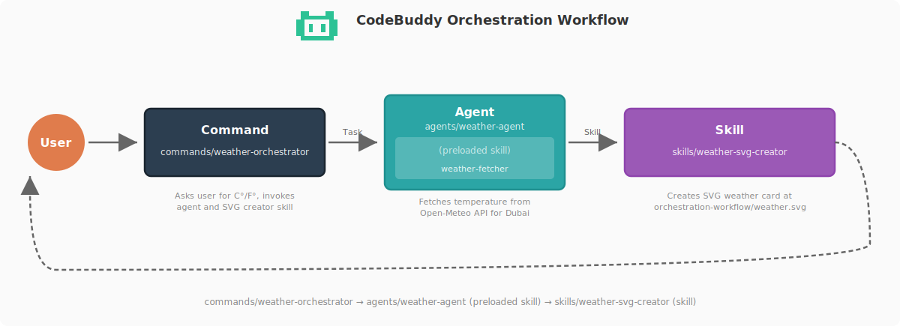

# CodeBuddy Code 最佳实践

> **说明**：本文档参考借鉴自https://github.com/shanraisshan/codebuddy-code-best-practice

---

# CodeBuddy Code 最佳实践
熟能生巧，CodeBuddy 完美

## 🧠 核心概念

| 功能 | 位置 | 描述 |
|---------|----------|-------------|
|  [**Subagents**](https://www.codebuddy.cn/docs/cli/en/sub-agents) | `.codebuddy/agents/<name>.md` | [](best-practice/codebuddy-subagents.md) [](implementation/codebuddy-subagents-implementation.md) 在全新独立上下文中运行的自主执行者 — 自定义工具、权限、模型、记忆和持久身份 |
|  [**Commands**](https://www.codebuddy.cn/docs/cli/en/slash-commands) | `.codebuddy/commands/<name>.md` | [](best-practice/codebuddy-commands.md) [](implementation/codebuddy-commands-implementation.md) 注入到现有上下文的知识 — 简单的用户调用提示模板，用于工作流编排 |
|  [**Skills**](https://www.codebuddy.cn/docs/cli/en/skills) | `.codebuddy/skills/<name>/SKILL.md` | [](best-practice/codebuddy-skills.md) [](implementation/codebuddy-skills-implementation.md) 注入到现有上下文的知识 — 可配置、可预加载、可自动发现, with 上下文分叉和渐进式披露 · [Official Skills](https://github.com/anthropics/skills/tree/main/skills) |
| [**Workflows**](https://www.codebuddy.cn/docs/cli/en/common-workflows) | [`.codebuddy/commands/weather-orchestrator.md`](.codebuddy/commands/weather-orchestrator.md) | [](orchestration-workflow/orchestration-workflow.md) |
| [**Hooks**](https://www.codebuddy.cn/docs/cli/en/hooks) | `.codebuddy/hooks/` | [](https://github.com/shanraisshan/codebuddy-code-hooks) [](https://github.com/shanraisshan/codebuddy-code-hooks) 用户定义的处理程序 (scripts, HTTP, prompts, agents) that run outside the agentic loop on specific events · [Guide](https://www.codebuddy.cn/docs/cli/en/hooks-guide) |
| [**MCP Servers**](https://www.codebuddy.cn/docs/cli/en/mcp) | `.codebuddy/settings.json`, `.mcp.json` | [](best-practice/codebuddy-mcp.md) [](.mcp.json) Model Context Protocol 连接 to 外部工具、数据库和 API |
| [**Plugins**](https://www.codebuddy.cn/docs/cli/en/plugins) | 可分发包 | Bundles of skills, subagents, hooks, and MCP servers · [Marketplaces](https://www.codebuddy.cn/docs/cli/en/discover-plugins) · [Create Marketplaces](https://www.codebuddy.cn/docs/cli/en/plugin-marketplaces) |
| [**Settings**](https://www.codebuddy.cn/docs/cli/en/settings) | `.codebuddy/settings.json` | [](best-practice/codebuddy-settings.md) [](.codebuddy/settings.json) 分层配置系统 · [Permissions](https://www.codebuddy.cn/docs/cli/en/permissions) · [Model Config](https://www.codebuddy.cn/docs/cli/en/model-config) · [Output Styles](https://www.codebuddy.cn/docs/cli/en/output-styles) · [Sandboxing](https://www.codebuddy.cn/docs/cli/en/sandboxing) · [Keybindings](https://www.codebuddy.cn/docs/cli/en/keybindings) · [Fast Mode](https://www.codebuddy.cn/docs/cli/en/fast-mode) |
| [**Status Line**](https://www.codebuddy.cn/docs/cli/en/statusline) | `.codebuddy/settings.json` | [](https://github.com/shanraisshan/codebuddy-code-status-line) [](.codebuddy/settings.json) 可自定义状态栏 显示上下文使用量、模型、成本和会话信息 |
| [**Memory**](https://www.codebuddy.cn/docs/cli/en/memory) | `CODEBUDDY.md`, `.codebuddy/rules/`, `~/.codebuddy/rules/`, `~/.codebuddy/projects/<project>/memory/` | [](best-practice/codebuddy-memory.md) [](CODEBUDDY.md) 持久化上下文 via CODEBUDDY.md files and `@path` imports · [Auto Memory](https://www.codebuddy.cn/docs/cli/en/memory) · [Rules](https://www.codebuddy.cn/docs/cli/en/memory#organize-rules-with-clauderules) |
| [**Checkpointing**](https://www.codebuddy.cn/docs/cli/en/checkpointing) | automatic (git-based) | 自动跟踪文件编辑 支持回退 (`Esc Esc` or `/rewind`) 和定向摘要 |
| [**CLI Startup Flags**](https://www.codebuddy.cn/docs/cli/en/cli-reference) | `codebuddy [flags]` | [](best-practice/codebuddy-cli-startup-flags.md) 命令行标志、子命令和环境变量 用于启动 CodeBuddy Code · [Interactive Mode](https://www.codebuddy.cn/docs/cli/en/interactive-mode) |
| **AI Terms** | | [](https://github.com/shanraisshan/codebuddy-code-codex-cursor-gemini/blob/main/reports/ai-terms.md) Agentic Engineering · Context Engineering · Vibe Coding |
| [**Best Practices**](https://www.codebuddy.cn/docs/cli/en/best-practices) | | Official best practices · [Prompt Engineering](https://github.com/anthropics/prompt-eng-interactive-tutorial) · [Extend CodeBuddy Code](https://www.codebuddy.cn/docs/cli/en/features-overview) |

### 🔥 热门功能

| 功能 | 位置 | 描述 |
|---------|----------|-------------|
| [**Auto Mode**](https://www.codebuddy.cn/docs/cli/en/permission-modes#eliminate-prompts-with-auto-mode)  | `--permission-mode auto` | [](https://x.com/claudeai/status/2036503582166393240) 后台安全分类器取代手动权限提示 — CodeBuddy 判断什么是安全的，同时阻止提示注入 and risky escalations · [Blog](https://claude.com/blog/auto-mode) |
| [**Channels**](https://www.codebuddy.cn/docs/cli/en/channels)  | `--channels`, plugin-based | 从 Telegram、Discord 或 webhooks 推送事件 到运行中的会话 — 当你不在时 CodeBuddy 会响应 · [Reference](https://www.codebuddy.cn/docs/cli/en/channels-reference) |
| [**Slack**](https://www.codebuddy.cn/docs/cli/en/slack) | `@CodeBuddy` in Slack | 在团队聊天中 @CodeBuddy 分配编程任务 — 路由到 CodeBuddy Code 网页会话 用于 bug 修复、代码审查和并行任务执行 |
| [**Code Review**](https://www.codebuddy.cn/docs/cli/en/code-review)  | GitHub App (managed) | [](https://x.com/claudeai/status/2031088171262554195) 多代理 PR 分析，捕获 bug、安全漏洞和回归问题 · [Blog](https://claude.com/blog/code-review) |
| [**GitHub Actions**](https://www.codebuddy.cn/docs/cli/en/github-actions) | `.github/workflows/` | 自动化 PR 审查、issue 分类和代码生成 在 CI/CD 流水线中 · [GitLab CI/CD](https://www.codebuddy.cn/docs/cli/en/gitlab-ci-cd) |
| [**Chrome**](https://www.codebuddy.cn/docs/cli/en/chrome)  | `--chrome`, extension | 通过 CodeBuddy 在 Chrome 中进行浏览器自动化 — 测试 web 应用、使用控制台调试、自动化表单、从页面提取数据 |
| [**Scheduled Tasks**](https://www.codebuddy.cn/docs/cli/en/scheduled-tasks) | `/loop`, `/schedule`, cron tools | [](https://x.com/bcherny/status/2030193932404150413) [](implementation/codebuddy-scheduled-tasks-implementation.md) `/loop` 在本地按计划定期运行提示 (up to 3 days) · [`/schedule`](https://www.codebuddy.cn/docs/cli/en/web-scheduled-tasks) 在云端基础设施上运行提示 — 即使你的机器关闭也能工作 · [Announcement](https://x.com/noahzweben/status/2036129220959805859) |
| [**Voice Dictation**](https://www.codebuddy.cn/docs/cli/en/voice-dictation)  | `/voice` | [](https://x.com/trq212/status/2028628570692890800) 按说话式语音输入提示 支持 20 种语言 可重新绑定激活键 |
| [**Simplify & Batch**](https://www.codebuddy.cn/docs/cli/en/skills#bundled-skills) | `/simplify`, `/batch` | [](https://x.com/bcherny/status/2027534984534544489) 内置技能，用于代码质量和批量操作 — simplify 重构以提高复用性和效率, batch 跨文件运行命令 |
| [**Agent Teams**](https://www.codebuddy.cn/docs/cli/en/agent-teams)  | built-in (env var) | [](https://x.com/bcherny/status/2019472394696683904) [](implementation/codebuddy-agent-teams-implementation.md) 多个代理并行工作 在同一代码库上共享任务协调 |
| [**Remote Control**](https://www.codebuddy.cn/docs/cli/en/remote-control) | `/remote-control`, `/rc` | [](https://x.com/noahzweben/status/2032533699116355819) 从任何设备继续本地会话 — 手机、平板或浏览器 · [Headless Mode](https://www.codebuddy.cn/docs/cli/en/headless) |
| [**Git Worktrees**](https://www.codebuddy.cn/docs/cli/en/common-workflows#run-parallel-codebuddy-code-sessions-with-git-worktrees) | built-in | [](https://x.com/bcherny/status/2025007393290272904) 独立的 git 分支用于并行开发 — 每个代理都有自己的工作副本 |
| [**Ralph Wiggum Loop**](https://github.com/anthropics/codebuddy-code/tree/main/plugins/ralph-wiggum) | plugin | [](https://github.com/ghuntley/how-to-ralph-wiggum) [](https://github.com/shanraisshan/novel-llm-26) 长时间运行任务的自主开发循环 — 迭代直到完成 |

<p align="center">
  
</p>

<a id="orchestration-workflow"></a>

## <a href="orchestration-workflow/orchestration-workflow.md"></a>

请参阅 [orchestration-workflow](orchestration-workflow/orchestration-workflow.md) 以了解  **Command** →  **Agent** →  **Skill** 模式的实现细节。


<p align="center">
  
</p>

<p align="center">
  
</p>


```bash
claude
/weather-orchestrator
```

<p align="center">
  
</p>

## ⚙️ 开发工作流

All major workflows converge on the same architectural pattern: **Research → Plan → Execute → Review → Ship**

| 名称 | ★ | 特点 | 计划 |  |  |  |
|------|---|------------|------|---|---|---|
| [Superpowers](https://github.com/obra/superpowers) | 11.8万 |    |  [writing-plans](https://github.com/obra/superpowers/tree/main/skills/writing-plans) | 5 | 3 | 14 |
| [Everything CodeBuddy Code](https://github.com/affaan-m/everything-codebuddy-code) | 11.1万 |    |  [planner](https://github.com/affaan-m/everything-codebuddy-code/blob/main/agents/planner.md) | 28 | 63 | 125 |
| [Spec Kit](https://github.com/github/spec-kit) | 8.3万 |    |  [speckit.plan](https://github.com/github/spec-kit/blob/main/templates/commands/plan.md) | 0 | 9+ | 0 |
| [gstack](https://github.com/garrytan/gstack) | 52k |    |  [autoplan](https://github.com/garrytan/gstack/tree/main/autoplan) | 0 | 0 | 31 |
| [Get Shit Done](https://github.com/gsd-build/get-shit-done) | 43k |    |  [gsd-planner](https://github.com/gsd-build/get-shit-done/blob/main/agents/gsd-planner.md) | 18 | 57 | 0 |
| [BMAD-METHOD](https://github.com/bmad-code-org/BMAD-METHOD) | 43k |    |  [bmad-create-prd](https://github.com/bmad-code-org/BMAD-METHOD/tree/main/src/bmm-skills/2-plan-workflows/bmad-create-prd) | 0 | 0 | 42 |
| [OpenSpec](https://github.com/Fission-AI/OpenSpec) | 35k星 |    |  [opsx:propose](https://github.com/Fission-AI/OpenSpec/blob/main/src/commands/workflow/new-change.ts) | 0 | 11 | 0 |
| [Compound Engineering](https://github.com/EveryInc/compound-engineering-plugin) | 11k星 |    |  [ce-plan](https://github.com/EveryInc/compound-engineering-plugin/tree/main/plugins/compound-engineering/skills/ce-plan) | 47 | 4 | 42 |
| [HumanLayer](https://github.com/humanlayer/humanlayer) | 10k星 |    |  [create_plan](https://github.com/humanlayer/humanlayer/blob/main/.codebuddy/commands/create_plan.md) | 6 | 27 | 0 |

### 其他
- [跨模型 (CodeBuddy Code + Codex) 工作流](development-workflows/cross-model-workflow/cross-model-workflow.md) [](development-workflows/cross-model-workflow/cross-model-workflow.md)
- [RPI](development-workflows/rpi/rpi-workflow.md) [](development-workflows/rpi/rpi-workflow.md)
- [Ralph Wiggum 循环](https://www.youtube.com/watch?v=eAtvoGlpeRU) [](https://github.com/shanraisshan/novel-llm-26)
- [Andrej Karpathy (OpenAI 创始成员) 工作流](https://x.com/karpathy/status/2015883857489522876)
- [Peter Steinberger (OpenClaw 创建者) 工作流](https://youtu.be/8lF7HmQ_RgY?t=2582)
- Boris Cherny (CodeBuddy Code 创建者) 工作流 — [13 个技巧](tips/codebuddy-boris-13-tips-03-jan-26.md) · [10 个技巧](tips/codebuddy-boris-10-tips-01-feb-26.md) · [12 个技巧](tips/codebuddy-boris-12-tips-12-feb-26.md) · [2 个技巧](tips/codebuddy-boris-2-tips-25-mar-26.md) [](https://x.com/bcherny)

<p align="center">
  
</p>

## 💡 技巧与窍门 (86)

🚫👶 = 不要过度监管

[提示](#tips-prompting) · [规划](#tips-planning) · [CODEBUDDY.md](#tips-claudemd) · [Agent](#tips-agents) · [命令](#tips-commands) · [Skill](#tips-skills) · [Hook](#tips-hooks) · [工作流](#tips-workflows) · [高级](#tips-workflows-advanced) · [Git / PR](#tips-git-pr) · [调试](#tips-debugging) · [工具](#tips-utilities) · [日常](#tips-daily)


<a id="tips-prompting"></a>■ **提示技巧 (3)**

| 技巧 | 来源 |
|-----|--------|
| 挑战 CodeBuddy — "严格审查这些更改，直到我通过你的测试再提交 PR。" 或 "向我证明这能行" 并让 CodeBuddy 对比主分支与你的分支差异 🚫👶 | [](https://x.com/bcherny/status/2017742752566632544) |
| 在完成一个普通的修复后 — "基于你现在的全部认知，放弃这个方案并实现优雅的解决方案" 🚫👶 | [](https://x.com/bcherny/status/2017742752566632544) |
| CodeBuddy 能自行修复大部分 Bug — 粘贴 Bug 描述，说"修复"，不要微观管理过程 🚫👶 | [](https://x.com/bcherny/status/2017742750473720121) |

<a id="tips-planning"></a>■ **计划/规范 (6)**

| 技巧 | 来源 |
|-----|--------|
| 始终从 [plan mode](https://www.codebuddy.cn/docs/cli/en/common-workflows) 开始 | [](https://x.com/bcherny/status/2007179845336527000) |
| 从一个最小化的规格或提示词开始，并使用 [AskUserQuestion](https://www.codebuddy.cn/docs/cli/en/cli-reference) 工具让 CodeBuddy 来采访你，然后开启一个新会话来执行该规格 | [](https://x.com/trq212/status/2005315275026260309) |
| 始终制定一个分阶段的门控计划，每个阶段都包含多个测试（单元测试、自动化测试、集成测试） | |
| 启动第二个 CodeBuddy 作为高级工程师来评审你的计划，或者使用 [cross-model](development-workflows/cross-model-workflow/cross-model-workflow.md) 进行评审 | [](https://x.com/bcherny/status/2017742745365057733) |
| 在移交工作之前，编写详细的规格并减少歧义——你越具体，输出就越好 | [](https://x.com/bcherny/status/2017742752566632544) |
| 原型优先于 PRD —— 构建 20-30 个版本，而不是编写规格，构建成本低所以可以多尝试 | [](https://youtu.be/julbw1JuAz0?t=3630) [](https://youtu.be/julbw1JuAz0?t=3630) |

<a id="tips-codebuddymd"></a>■ **CODEBUDDY.md (7)**

| 技巧 | 来源 |
|-----|--------|
| [CODEBUDDY.md](https://www.codebuddy.cn/docs/cli/en/memory) 建议每份文件控制在 [200 行以内](https://www.codebuddy.cn/docs/cli/en/memory#write-effective-instructions)。[humanlayer 项目中有 60 行的范例](https://www.humanlayer.dev/blog/writing-a-good-codebuddy-md)（[仍无法 100% 保证被遵守](https://www.reddit.com/r/ClaudeCode/comments/1qn9pb9/claudemd_says_must_use_agent_claude_ignores_it_80/)） | [](https://x.com/bcherny/status/2007179840848597422) [](https://www.humanlayer.dev/blog/writing-a-good-codebuddy-md) |
| 将领域特定的 CODEBUDDY.md 规则包裹在 [\<important if="..."\> 标签](https://www.hlyr.dev/blog/stop-codebuddy-from-ignoring-your-codebuddy-md) 中，以防止随着文件变长而被 CodeBuddy 忽略 | [](https://www.hlyr.dev/blog/stop-codebuddy-from-ignoring-your-codebuddy-md) |
| 在 monorepo 中使用 [多个 CODEBUDDY.md](best-practice/codebuddy-memory.md) — 采用祖先-后代加载机制 | |
| 使用 [.codebuddy/rules/](https://www.codebuddy.cn/docs/cli/en/memory#organize-rules-with-clauderules) 来拆分大段指令 | |
| [memory.md](https://www.codebuddy.cn/docs/cli/en/memory)，constitution.md 并不保证任何事情 | |
| 任何开发者都应该能够启动 CodeBuddy，说"运行测试"然后首次尝试就成功——如果没成功，说明你的 CODEBUDDY.md 缺少必要的设置/构建/测试命令 | [](https://x.com/dexhorthy/status/2034713765401551053) |
| 保持代码库整洁并完成迁移——部分迁移的框架会混淆模型，可能导致其选择错误的模式 | [](https://youtu.be/julbw1JuAz0?t=1112) [](https://youtu.be/julbw1JuAz0?t=1112) |
| 使用 [settings.json](best-practice/codebuddy-settings.md) 来配置工具强制执行的行为（署名、权限、模型）——当 `attribution.commit: ""` 是确定性设置时，不要在 CODEBUDDY.md 中写入“NEVER add Co-Authored-By” | [](https://x.com/dani_avila7/status/2036182734310195550) |

<a id="tips-agents"></a> **Agents (4)**

| 技巧 | 来源 |
|-----|--------|
| 采用具备特定功能的[子代理](https://www.codebuddy.cn/docs/cli/en/sub-agents)（附带额外上下文）配合[技能](https://www.codebuddy.cn/docs/cli/en/skills)（渐进式披露），而非通用问答或后端工程师角色 | [](https://x.com/bcherny/status/2007179850139000872) |
| 通过"使用子代理"指令调配更多计算资源——将任务分流以保持主上下文清晰聚焦 🚫👶 | [](https://x.com/bcherny/status/2017742755737555434) |
| 利用[tmux组建代理团队](https://www.codebuddy.cn/docs/cli/en/agent-teams)与[git worktrees](https://x.com/bcherny/status/2025007393290272904)实现并行开发 | |
| 使用[测试时计算](https://www.codebuddy.cn/docs/cli/en/sub-agents)——独立的上下文窗口能提升结果质量；一个代理可能产生错误，而另一个（相同模型）可发现这些错误 | [](https://x.com/bcherny/status/2031151689219321886) |

<a id="tips-commands"></a> **Commands (3)**

| 技巧 | 来源 |
|-----|--------|
| 使用 [commands](https://www.codebuddy.cn/docs/cli/en/slash-commands) 而非 [sub-agents](https://www.codebuddy.cn/docs/cli/en/sub-agents) 来构建工作流 | [](https://x.com/bcherny/status/2007179847949500714) |
| 将每天重复多次的"内部循环"工作流转化为 [slash commands](https://www.codebuddy.cn/docs/cli/en/slash-commands)——可避免重复输入提示词，这些命令存储在 `.codebuddy/commands/` 中并可通过 git 进行版本管理 | [](https://x.com/bcherny/status/2007179847949500714) |
| 若某个操作每天执行超过一次，请将其转化为 [skill](https://www.codebuddy.cn/docs/cli/en/skills) 或 [command](https://www.codebuddy.cn/docs/cli/en/slash-commands)——例如构建 `/techdebt`、上下文转储或数据分析等专用命令 | [](https://x.com/bcherny/status/2017742748984742078) |

<a id="tips-skills"></a> **Skills (9)**

| 技巧 | 来源 |
|-----|--------|
| 使用 [context: fork](https://www.codebuddy.cn/docs/cli/en/skills) 在隔离的子代理中运行技能——主上下文只能看到最终结果，看不到中间工具调用。`agent` 字段允许设置子代理类型 | [](https://x.com/lydiahallie/status/2033603164398883042) |
| 对 monorepos 使用[子文件夹中的技能](reports/codebuddy-skills-for-larger-mono-repos.md) | |
| 技能是文件夹，不是文件——使用 `references/`、`scripts/`、`examples/` 子目录实现[渐进式披露](https://www.codebuddy.cn/docs/cli/en/skills) | [](https://x.com/trq212/status/2033949937936085378) |
| 在每个技能中构建 "Gotchas" 部分——这是高信息密度的内容，随时间推移添加 CodeBuddy 的失败点 | [](https://x.com/trq212/status/2033949937936085378) |
| 技能的描述字段是触发器，不是摘要——为模型编写（"我应该在何时触发？"） | [](https://x.com/trq212/status/2033949937936085378) |
| 不要在技能中陈述显而易见的事情——专注于推动 CodeBuddy 脱离其默认行为的因素 🚫👶 | [](https://x.com/trq212/status/2033949937936085378) |
| 不要在技能中过度限制 CodeBuddy——给出目标和约束，而不是规定性的逐步指令 🚫👶 | [](https://x.com/trq212/status/2033949937936085378) |
| 在技能中包含脚本和库，让 CodeBuddy 进行组合，而不是重新构造样板代码 | [](https://x.com/trq212/status/2033949937936085378) |
| 在 SKILL.md 中嵌入 `` !`command` `` 以将动态 Shell 输出注入提示——CodeBuddy 在调用时运行它，模型只看到结果 | [](https://x.com/lydiahallie/status/2034337963820327017) |

<a id="tips-hooks"></a>■ **Hooks (5)**

| 技巧 | 来源 |
|-----|--------|
| 在 Skills 中使用 [按需调用 hooks](https://www.codebuddy.cn/docs/cli/en/skills) — `/careful` 命令可阻止破坏性命令，`/freeze` 可阻止目录外的编辑 | [](https://x.com/trq212/status/2033949937936085378) |
| 通过 PreToolUse hook [衡量 Skill 使用情况](https://www.codebuddy.cn/docs/cli/en/skills)，以发现常用或低频触发的 Skill | [](https://x.com/trq212/status/2033949937936085378) |
| 使用 [PostToolUse hook](https://www.codebuddy.cn/docs/cli/en/hooks) 自动格式化代码 — CodeBuddy 生成格式良好的代码，该 hook 处理最后 10% 以避免 CI 失败 | [](https://x.com/bcherny/status/2007179852047335529) |
| 通过 hook 将[权限请求](https://www.codebuddy.cn/docs/cli/en/hooks)路由至 Opus — 让其扫描攻击并自动批准安全请求 🚫👶 | [](https://x.com/bcherny/status/2017742755737555434) |
| 使用 [Stop hook](https://www.codebuddy.cn/docs/cli/en/hooks) 在回合结束时提示 CodeBuddy 继续执行或验证其工作 | [](https://x.com/bcherny/status/2021701059253874861) |

<a id="tips-workflows"></a>■ **工作流 (7)**

| 技巧 | 来源 |
|-----|--------|
| 避免agent dumb zone，在达到50%容量上限时手动执行 `/compact` 命令。若切换至新任务，使用 `/clear` 重置会话上下文 | |
| 对于较小任务，原版CodeBuddy Code优于任何工作流 | |
| 使用 `/model` 选择模型和推理模式，用 `/context` 查看上下文使用情况，用 `/usage` 检查计划限额，用 `/extra-usage` 配置超额计费，用 `/config` 配置设置——计划模式用Opus，编码用Sonnet以实现最佳组合 | [](https://x.com/_catwu/status/1955694117264261609) |
| 在 `/config` 中始终启用 [思考模式](https://www.codebuddy.cn/docs/cli/en/model-config)（查看推理过程）和[输出样式](https://www.codebuddy.cn/docs/cli/en/output-styles)Explanatory（查看带★洞察框的详细输出），以便更好理解CodeBuddy的决策逻辑 | [](https://x.com/bcherny/status/2007179838864666847) |
| 在提示词中使用ultrathink关键词触发[高努力推理模式](https://docs.anthropic.com/en/docs/build-with-claude/extended-thinking#tips-and-best-practices) | |
| 使用 `/rename` 重命名重要会话（例如 |

| 使用技巧 | 参考资料 |
|----------|----------|
| 使用[TODO - 重构任务]标记任务，之后可通过[/resume](https://www.codebuddy.cn/docs/cli/en/cli-reference)继续——同时运行多个CodeBuddy实例时，请为每个实例添加标签 | [](https://every.to/podcast/how-to-use-codebuddy-code-like-the-people-who-built-it) |
| 当CodeBuddy偏离正轨时，使用[连续两次Esc或/rewind](https://www.codebuddy.cn/docs/cli/en/checkpointing)撤销操作，而不是在当前上下文中尝试修复 | |

<a id="tips-workflows-advanced"></a>■ **高级工作流 (6)**

| 技巧 | 来源 |
|-----|--------|
| 大量使用 ASCII 图表来理解架构 | [](https://x.com/bcherny/status/2017742759218794768) |
| 使用 [/loop](https://www.codebuddy.cn/docs/cli/en/scheduled-tasks) 进行本地定期监控（最长3天）；使用 [/schedule](https://www.codebuddy.cn/docs/cli/en/web-scheduled-tasks) 处理云端定期任务（即使设备关闭也能运行） | |
| 使用 [Ralph Wiggum 插件](https://github.com/shanraisshan/novel-llm-26) 处理长时间自主任务 | [](https://x.com/bcherny/status/2007179858435281082) |
| 使用带通配符语法的 [/permissions](https://www.codebuddy.cn/docs/cli/en/permissions)（如 Bash(npm run *)、Edit(/docs/**)）替代危险的权限跳过功能 | [](https://x.com/bcherny/status/2007179854077407667) |
| 使用 [/sandbox](https://www.codebuddy.cn/docs/cli/en/sandboxing) 通过文件和网络隔离减少权限提示——内部测试减少84% | [](https://x.com/bcherny/status/2021700506465579443) [](https://creatoreconomy.so/p/inside-codebuddy-code-how-an-ai-native-actually-works-cat-wu) |
| 投资开发[产品验证](https://www.codebuddy.cn/docs/cli/en/skills)技能（如注册流程驱动、结账验证器）——值得花一周时间完善 | [](https://x.com/trq212/status/2033949937936085378) |

<a id="tips-git-pr"></a>■ **Git / PR (5)**

| 技巧 | 来源 |
|-----|--------|
| 保持 PR 小巧且专注 — [每118行中的第50行](tips/codebuddy-boris-2-tips-25-mar-26.md)（一天内提交141个 PR，变更4.5万行代码），每个 PR 只处理一个功能，便于审查和回滚 | [](https://x.com/bcherny/status/2038552880018538749) |
| 始终[压缩合并](tips/codebuddy-boris-2-tips-25-mar-26.md) PR — 保持清晰的线性提交历史，每个功能对应一个提交，便于使用 `git revert` 和 `git bisect` | [](https://x.com/bcherny/status/2038552880018538749) |
| 频繁提交 — 尽量每小时至少提交一次，任务完成后立即提交 | |
| 在同事的 PR 中 @提及 [@codebuddy](https://github.com/apps/codebuddy) 以自动生成针对重复审查反馈的 lint 规则 — 将自己从代码审查中自动化出去 🚫👶 | [](https://youtu.be/julbw1JuAz0?t=2715) [](https://youtu.be/julbw1JuAz0?t=2715) |
| 使用 [/code-review](https://www.codebuddy.cn/docs/cli/en/code-review) 进行多代理 PR 分析 — 在合并前捕获错误、安全漏洞和回归问题 | [](https://x.com/bcherny/status/2031089411820228645) |

<a id="tips-debugging"></a>■ **调试 (7)**

| 技巧 | 来源 |
|-----|--------|
| 遇到任何问题时，养成随时截图并与 CodeBuddy 分享的习惯 | |
| 使用 MCP（[Chrome 中的 CodeBuddy](https://www.codebuddy.cn/docs/cli/en/chrome)、[Playwright](https://github.com/microsoft/playwright-mcp)、[Chrome DevTools](https://developer.chrome.com/blog/chrome-devtools-mcp)）让 CodeBuddy 能够自行查看 Chrome 控制台日志 | |
| 始终让 CodeBuddy 将需要查看日志的终端作为后台任务运行，以获得更好的调试效果 | |
| 使用 [/doctor](https://www.codebuddy.cn/docs/cli/en/cli-reference) 诊断安装、认证和配置问题 | |
| 压缩过程中出现的错误可以通过使用 [/model](https://www.codebuddy.cn/docs/cli/en/model-config) 选择一个 1M token 的模型，然后运行 [/compact](https://www.codebuddy.cn/docs/cli/en/interactive-mode) 来解决 | |
| 使用[跨模型](development-workflows/cross-model-workflow/cross-model-workflow.md)流程进行质量检查——例如，使用 [Codex](https://github.com/shanraisshan/codex-cli-best-practice) 进行计划与实现审查 | |
| 代理式搜索（glob + grep）优于 RAG——CodeBuddy Code 尝试过并弃用了向量数据库，因为代码同步会漂移且权限管理复杂 | [](https://youtu.be/julbw1JuAz0?t=3095) [](https://youtu.be/julbw1JuAz0?t=3095) |

<a id="tips-utilities"></a>■ **工具 (5)**

| 技巧 | 来源 |
|-----|--------|
| 使用 [iTerm](https://iterm2.com/)/[Ghostty](https://ghostty.org/)/[tmux](https://github.com/tmux/tmux) 终端，而非 IDE（[VS Code](https://code.visualstudio.com/)/[Cursor](https://www.cursor.com/)） | [](https://x.com/bcherny/status/2017742753971769626) |
| 使用 [Wispr Flow](https://wisprflow.ai) 进行语音提示（10倍生产力） | |
| 使用 [codebuddy-code-hooks](https://github.com/shanraisshan/codebuddy-code-hooks) 获取 CodeBuddy 反馈 | |
| 使用 [状态行](https://github.com/shanraisshan/codebuddy-code-status-line) 以增强上下文感知和快速压缩 | [](https://x.com/bcherny/status/2021700784019452195) |
| 探索 [settings.json](best-practice/codebuddy-settings.md) 功能，如 [计划目录](best-practice/codebuddy-settings.md#plans-directory)、[旋转动词](best-practice/codebuddy-settings.md#display--ux)，以获得个性化体验 | [](https://x.com/bcherny/status/2021701145023197516) |

<a id="tips-daily"></a>■ **日常 (3)**

| 技巧 | 来源 |
|-----|--------|
| 每日[更新](https://www.codebuddy.cn/docs/cli/en/setup) CodeBuddy Code 并通过阅读[更新日志](https://github.com/anthropics/codebuddy-code/blob/main/CHANGELOG.md)开始新的一天 | |
| 关注 [r/ClaudeAI](https://www.reddit.com/r/ClaudeAI/)、[r/ClaudeCode](https://www.reddit.com/r/ClaudeCode/) |  |
| 关注 [Boris](https://x.com/bcherny)、[Thariq](https://x.com/trq212)、[Cat](https://x.com/_catwu)、[Lydia](https://x.com/lydiahallie)、[Noah](https://x.com/noahzweben)、[Anthony](https://x.com/amorriscode)、[Alex](https://x.com/alexalbert__)、[Kenneth](https://x.com/neilhtennek)、[Claude](https://x.com/claudeai) |  |


| 文章/推文 | 来源 |
|-----------------|--------|
| [Squash Merging & PR Size Distribution (Boris) \| 2026年3月25日](tips/codebuddy-boris-2-tips-25-mar-26.md) | [推文](https://x.com/bcherny/status/2038552880018538749) |
| [Lessons from Building CodeBuddy Code: How We Use Skills (Thariq) \| 2026年3月17日](tips/codebuddy-thariq-tips-17-mar-26.md) | [文章](https://x.com/trq212/status/2033949937936085378) |
| [Code Review & Test Time Compute (Boris) \| 2026年3月10日](tips/codebuddy-boris-2-tips-10-mar-26.md) | [推文](https://x.com/bcherny/status/2031089411820228645) |
| /loop — 为最多3天调度重复任务 (Boris) \| 2026年3月7日 | [推文](https://x.com/bcherny/status/2030193932404150413) |
| AskUserQuestion + ASCII Markdowns (Thariq) \| 2026年2月28日 | [推文](https://x.com/trq212/status/2027543858289250472) |
| Seeing like an Agent - 构建 CodeBuddy Code 的经验教训 (Thariq) \| 2026年2月28日 | [文章](https://x.com/trq212/status/2027463795355095314) |
| Git Worktrees - Boris 使用的5种方式 \| 2026年2月21日 | [推文](https://x.com/bcherny/status/2025007393290272904) |
| Lessons from Building CodeBuddy Code: Prompt Caching Is Everything (Thariq) \| 2026年2月20日 | [文章](https://x.com/trq212/status/2024574133011673516) |
| [12种人们自定义其CodeBuddy的方式 (Boris) \| 2026年2月12日](tips/codebuddy-boris-12-tips-12-feb-26.md) | [推文](https://x.com/bcherny/status/2021699851499798911) |
| [来自团队使用CodeBuddy Code的10个提示 (Boris) \| 2026年2月1日](tips/codebuddy-boris-10-tips-01-feb-26.md) | [推文](https://x.com/bcherny/status/2017742741636321619) |
| [我如何使用CodeBuddy Code — 来自我出人意料的常规设置的13个提示 (Boris) \| 2026年1月3日](tips/codebuddy-boris-13-tips-03-jan-26.md) | [推文](https://x.com/bcherny/status/2007179832300581177) |
| 要求CodeBuddy使用AskUserQuestion工具采访你 (Thariq) \| 2025年12月28日 | [推文](https://x.com/trq212/status/2005315275026260309) |
| 始终使用计划模式，给CodeBuddy一种验证方法，使用 /code-review (Boris) \| 2025年12月27日 | [推文](https://x.com/bcherny/status/2004711722926616680) |


<p align="center">
  
</p>

## ☠️ STARTUPS / BUSINESSES

| CodeBuddy 功能 | 替代方案 |
|-|-|
|[**代码审查**](https://www.codebuddy.cn/docs/cli/en/code-review)|[Greptile](https://greptile.com), [CodeRabbit](https://coderabbit.ai), [Devin Review](https://devin.ai), [OpenDiff](https://opendiff.com), [Cursor BugBot](https://bugbot.dev)|
|[**语音听写**](https://www.codebuddy.cn/docs/cli/en/voice-dictation)|[Wispr Flow](https://wisprflow.ai), [SuperWhisper](https://superwhisper.com/)|
|[**远程控制**](https://www.codebuddy.cn/docs/cli/en/remote-control)|[OpenClaw](https://openclaw.ai/)|
|[**协作模式**](https://claude.com/blog/cowork-research-preview)|[OpenAI Operator](https://openai.com/operator), [AgentShadow](https://agentshadow.ai)|
|[**任务处理**](https://x.com/trq212/status/2014480496013803643)|[Beads](https://github.com/steveyegge/beads)|
|[**计划模式**](https://www.codebuddy.cn/docs/cli/en/common-workflows)|[Agent OS](https://github.com/buildermethods/agent-os)|
|[**技能/插件**](https://www.codebuddy.cn/docs/cli/en/plugins)|YC AI 包装类初创公司 ([reddit](https://reddit.com/r/ClaudeAI/comments/1r6bh4d/claude_code_skills_are_basically_yc_ai_startup/))|

<p align="center">
  
</p>

<a id="billion-dollar-questions"></a>


**Memory & Instructions (4)**

1. 应该在 CODEBUDDY.md 中写入哪些确切内容——以及应该排除什么？
2. 如果你已经有 CODEBUDDY.md 文件，是否真的需要单独的 constitution.md 或 rules.md？
3. 应该多久更新一次 CODEBUDDY.md？如何判断它是否已经过时？
4. 为什么 CodeBuddy 仍然会忽略 CODEBUDDY.md 的指令——即使指令中用了全大写的 MUST？（[reddit](https://reddit.com/r/ClaudeCode/comments/1qn9pb9/claudemd_says_must_use_agent_claude_ignores_it_80/)）

**Agents, Skills & Workflows (6)**

1. 何时应使用命令、代理或技能 —— 以及何时原生的 CodeBuddy Code 更优？  
2. 随着模型改进，应多久更新一次代理、命令和工作流？  
3. 为子代理设定详细人设是否能提升质量？研究/问答类子代理的“完美人设/提示”应包含什么？  
4. 是否应依赖 CodeBuddy Code 内置的计划模式 —— 还是构建自定义计划命令/代理来强制执行团队工作流？  
5. 若拥有个人技能（例如符合自身编码风格的 /implement），如何整合社区技能（例如 /simplify）以避免冲突 —— 当两者出现分歧时应以谁为准？  
6. 技术是否已成熟？能否将现有代码库转化为规格说明、删除代码，然后让 AI 仅凭这些规格说明重新生成完全一致的代码？

**Specs & Documentation (3)**

1.  是否应该为代码仓库中的每个功能都创建一个 Markdown 格式的规范文档？
2.  规范文档需要多久更新一次，才能在实现新功能时避免变得过时？
3.  在实现新功能时，如何处理它对其他功能规范文档产生的连锁影响？

<p align="center">
  
</p>

## REPORTS

<p align="center">
 <a href="reports/codebuddy-agent-sdk-vs-cli-system-prompts.md"></a>
 <a href="reports/codebuddy-in-chrome-v-chrome-devtools-mcp.md"></a>
 <a href="reports/codebuddy-global-vs-project-settings.md"></a>
 <a href="reports/codebuddy-skills-for-larger-mono-repos.md"></a>
 <br>
 <a href="reports/codebuddy-agent-memory.md"></a>
 <a href="reports/codebuddy-advanced-tool-use.md"></a>
 <a href="reports/codebuddy-usage-and-rate-limits.md"></a>
 <a href="reports/codebuddy-agent-command-skill.md"></a>
 <br>
 <a href="reports/llm-day-to-day-degradation.md"></a>
</p>

<p align="center">
  
</p>


1. 像学习课程一样阅读这个仓库，在尝试使用前，了解commands、agents、skills和hooks是什么。
2. 克隆这个仓库并尝试示例，试试`/weather-orchestrator`，听听hook的声音，运行agent团队，以便了解它们的实际工作方式。
3. 进入你自己的项目，让CodeBuddy建议你应该从这个仓库中添加哪些最佳实践，把它作为参考提供给CodeBuddy，这样它就知道有哪些可能。

<p align="center">
  
</p>

<p align="center">
  <a href="https://github.com/trending?since=monthly"></a><br>
  ✨ 2026年3月 GitHub 热门项目 ✨
</p>

## Other Repos

<a href="https://github.com/shanraisshan/codebuddy-code-hooks"></a> <a href="https://github.com/shanraisshan/codebuddy-code-hooks"><strong>CodeBuddy Code钩子</strong></a> · <a href="https://github.com/shanraisshan/codex-cli-best-practice"></a> <a href="https://github.com/shanraisshan/codex-cli-best-practice"><strong>Codex CLI最佳实践</strong></a> · <a href="https://github.com/shanraisshan/codex-cli-hooks"></a> <a href="https://github.com/shanraisshan/codex-cli-hooks"><strong>Codex CLI钩子</strong></a>

## Developed by


> | 工作流程 | 描述 |
> |----------|-------------|
> | /workflows:development-workflows | 通过并行研究所有8个工作流仓库，更新开发工作流表格及跨工作流分析报告 |
> | /workflows:best-practice:workflow-concepts | 使用最新的CodeBuddy Code功能和概念更新README概念章节 |
> | /workflows:best-practice:workflow-codebuddy-settings | 跟踪CodeBuddy Code设置报告的变更并识别需要更新的内容 |
> | /workflows:best-practice:workflow-codebuddy-subagents | 跟踪CodeBuddy Code子代理报告的变更并识别需要更新的内容 |
> | /workflows:best-practice:workflow-codebuddy-commands | 跟踪CodeBuddy Code命令报告的变更并识别需要更新的内容 |
> | /workflows:best-practice:workflow-codebuddy-skills | 跟踪CodeBuddy Code技能报告的变更并识别需要更新的内容 |

[](https://claude.com/contact-sales/codebuddy-for-oss)
[](https://claude.com/community/ambassadors)
[](https://anthropic.skilljar.com/codebuddy-certified-architect-foundations-access-request)
[](https://anthropic.skilljar.com/)

## Star History

[](https://star-history.com/#shanraisshan/codebuddy-code-best-practice&Date)