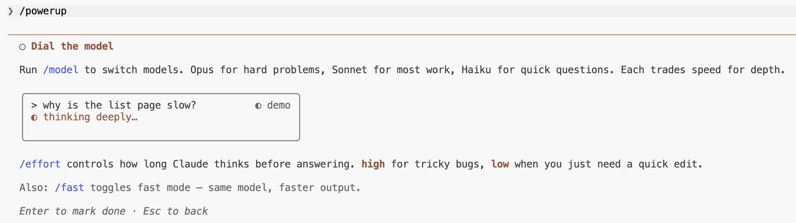
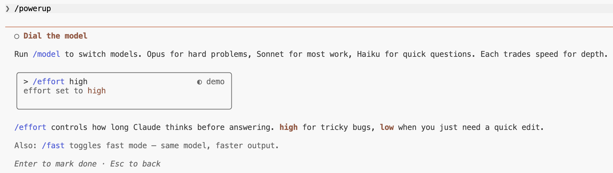

# 强化功能最佳实践


交互式课程，通过动画演示教授 CodeBuddy Code 功能。每个强化功能教授一件大多数人会错过的 CodeBuddy Code 能做的事。v2.1.90 引入。

<table width="100%">
<tr>
<td><a href="../">← 返回 CodeBuddy Code 最佳实践</a></td>
<td align="right"></td>
</tr>
</table>

---

## 使用方法

```bash
codebuddy
/powerup
```

---

## 强化功能 (10)

<p align="center">
  
</p>

| # | 强化功能 | 主题 |
|---|----------|--------|
| 1 | 与你的代码库对话 | `@` 文件，行引用 |
| 2 | 用模式引导 | `shift+tab`，plan，auto |
| 3 | 撤销任何操作 | `/rewind`，`Esc-Esc` |
| 4 | 后台运行 | tasks，`/tasks` |
| 5 | 教 CodeBuddy 你的规则 | `CODEBUDDY.md`，`/memory` |
| 6 | 用工具扩展 | MCP，`/mcp` |
| 7 | 自动化工作流 | skills，hooks |
| 8 | 分身术 | subagents，`/agents` |
| 9 | 随时编程 | `/remote-control`，`/teleport` |
| 10 | 调节模型 | `/model`，`/effort` |

---

## 示例：调节模型

最后一个强化功能用动画演示教授模型切换和努力控制。

<p align="center">
  
</p>

<p align="center">
  
</p>

<p align="center">
  
</p>

---

## Sources

- [Changelog — v2.1.90](https://code.codebuddy.cn/docs/en/changelog)
