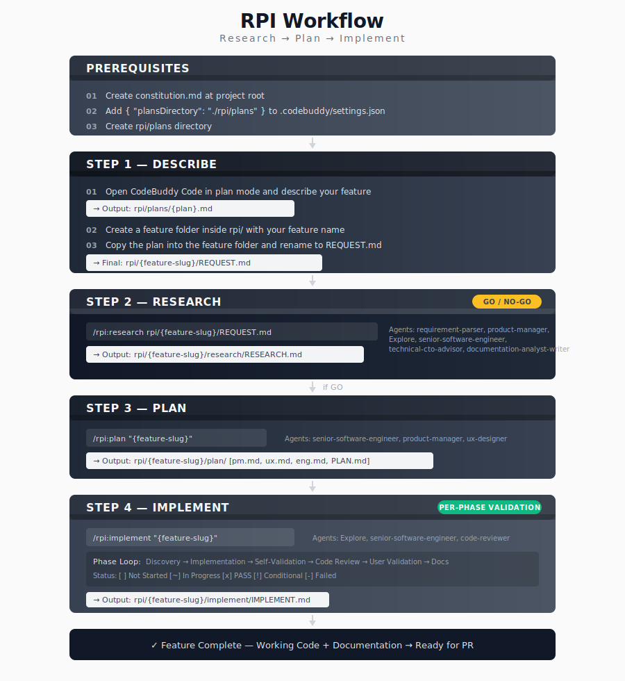

# RPI 工作流

**RPI** = **R**esearch → **P**lan → **I**mplement

一个系统化的开发工作流，在每个阶段设有验证关卡。防止在不可行的功能上浪费精力，并确保文档的完整性。

<table width="100%">
<tr>
<td><a href="../../">← 返回 CodeBuddy Code 最佳实践</a></td>
<td align="right"></td>
</tr>
</table>

---

## 概述



---

## 安装

将 `.codebuddy` 文件夹（包含 `agents/` 和 `commands/rpi/`）复制到你的仓库根目录，然后创建 `rpi/plans` 目录。

---

## 工作流示例

### 功能: 用户认证

**步骤 1: 描述**
```
User: "Add OAuth2 authentication with Google and GitHub providers"

1. CodeBuddy 生成计划
   → 输出：rpi/plans/oauth2-authentication.md
2. 创建特性文件夹：rpi/oauth2-authentication/
3. 将计划复制到该特性文件夹
4. 将计划重命名为 REQUEST.md
   → 最终文件：rpi/oauth2-authentication/REQUEST.md

**步骤 2: 研究**
```bash
/rpi:research rpi/oauth2-authentication/REQUEST.md
```
输出:
- `research/RESEARCH.md` 包含分析结果
- 判定: **GO**（可行，与战略一致）

**步骤 3: 计划**
```bash
/rpi:plan oauth2-authentication
```
输出:
- `plan/pm.md` - 用户故事和验收标准
- `plan/ux.md` - 登录界面流程
- `plan/eng.md` - 技术架构
- `plan/PLAN.md` - 3 个阶段，15 个任务

**步骤 4: 实现**
```bash
/rpi:implement oauth2-authentication
```
进度:
- 阶段 1: 后端基础 → 通过
- 阶段 2: 前端集成 → 通过
- 阶段 3: 测试与完善 → 通过

结果: 功能完成，可以提交 PR。

---

## 功能文件夹结构

所有功能相关工作都在 `rpi/{feature-slug}/` 目录下:

```
rpi/{feature-slug}/
├── REQUEST.md              # 步骤 1: 初始功能描述
├── research/
│   └── RESEARCH.md         # 步骤 2: GO/NO-GO 分析
├── plan/
│   ├── PLAN.md             # 步骤 3: 实现路线图
│   ├── pm.md               # 产品需求
│   ├── ux.md               # UX 设计
│   └── eng.md              # 技术规格
└── implement/
    └── IMPLEMENT.md        # 步骤 4: 实现记录
```

---

## Agents 和 Commands

| 命令 | 使用的 Agents |
|---------|---------------|
| `/rpi:research` | requirement-parser, product-manager, Explore, senior-software-engineer, technical-cto-advisor, documentation-analyst-writer |
| `/rpi:plan` | senior-software-engineer, product-manager, ux-designer, documentation-analyst-writer |
| `/rpi:implement` | Explore, senior-software-engineer, code-reviewer |