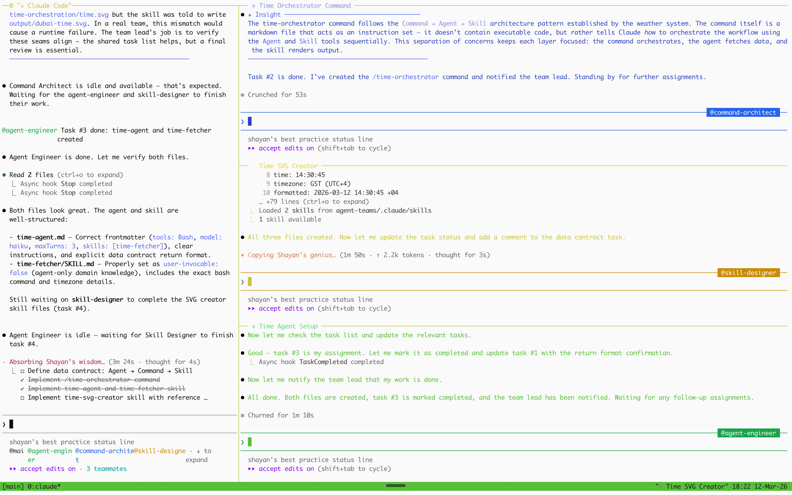

# Agent Teams 实现


<table width="100%">
<tr>
<td><a href="../">← 返回 CodeBuddy Code 最佳实践</a></td>
<td align="right"></td>
</tr>
</table>

---

<a href="#time-orchestration"></a>

<p align="center">
  
</p>

Agent Teams 会生成**多个独立的 CodeBuddy Code 会话**，通过共享任务列表进行协调。与 Subagents（单个会话内的隔离上下文分支）不同，每个队友都拥有自己的完整上下文窗口，自动加载 CODEBUDDY.md、MCP 服务器和 Skills。

---

## 

时间编排工作流完全由 Agent Teams 构建。运行成品：

```bash
cd agent-teams
codebuddy
/time-orchestrator
```

这将调用 **Command → Agent → Skill** 管道：Agent 获取迪拜当前时间，Skill 将时间卡片渲染为 SVG 并输出到 `agent-teams/output/dubai-time.svg`。

---

## 

你可以使用 Agent Teams 创建天气编排工作流的复制品——在这个示例中，时间编排工作流完全由 Agent Teams 构建。

### 1. 安装 [iTerm2](https://iterm2.com/) 和 tmux

```bash
brew install --cask iterm2
brew install tmux
```

### 2. 启动 iTerm2 → tmux → CodeBuddy

```bash
tmux new -s dev
CODEBUDDY_CODE_EXPERIMENTAL_AGENT_TEAMS=1 codebuddy
```

### 3. 使用团队结构提示词

<a id="time-orchestration"></a>

将以下提示词粘贴到 CodeBuddy 中，使用 Agent Teams 引导构建完整的时间编排工作流：

主提示词：**[agent-teams-prompt.md](../agent-teams/agent-teams-prompt.md)**

### 团队协调流程

```
┌──────────────────────────────────────────────────────────────┐
│                         LEAD (你)                             │
│       "创建一个 Agent Team 来构建时间编排"                     │
└──────────────────────────┬───────────────────────────────────┘
                           │ 生成团队（全部并行）
              ┌────────────┼────────────┐
              ▼            ▼            ▼
   ┌────────────────┐ ┌──────────┐ ┌──────────────┐
   │ Command        │ │ Agent    │ │ Skill        │
   │ 架构师         │ │ 工程师   │ │ 设计师       │
   │                │ │          │ │              │
   │ agent-teams/   │ │ agent-   │ │ agent-teams/ │
   │ .codebuddy/       │ │ teams/   │ │ .codebuddy/     │
   │ commands/      │ │ .codebuddy/ │ │ skills/      │
   │ time-          │ │ agents/  │ │ time-svg-    │
   │ orchestrator.md│ │ time-    │ │ creator/     │
   │                │ │ agent.md │ │              │
   └───────┬────────┘ └────┬─────┘ └──────┬───────┘
           │               │              │
           ▼               ▼              ▼
   ┌──────────────────────────────────────────────────┐
   │            共享任务列表                           │
   │  ☐ 达成数据契约：{time, tz, formatted}           │
   │  ☐ Command 使用 Agent 工具（非 bash）            │
   │  ☐ Agent 预加载 time-fetcher skill               │
   │  ☐ Skill 从上下文中读取时间（不重复获取）         │
   │  ☐ 所有文件位于 agent-teams/.codebuddy/ 目录下      │
   └──────────────────────────────────────────────────┘
                       │
                       ▼
          ┌──────────────────────────────┐
          │  cd agent-teams && codebuddy    │
          │    /time-orchestrator        │
          │   Command → Agent → Skill    │
          └──────────────────────────────┘
```
