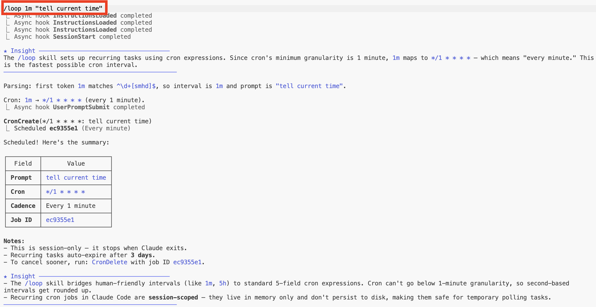

# Scheduled Tasks 实现


<table width="100%">
<tr>
<td><a href="../">← 返回 CodeBuddy Code 最佳实践</a></td>
<td align="right"></td>
</tr>
</table>

---

<a href="#loop-demo"></a>

`/loop` skill 用于在 cron 时间间隔上调度循环任务。以下是 `/loop 1m "tell current time"` 的演示——一个每分钟触发一次的简单循环任务。

---

## Loop 演示

### 1. 调度任务

<p align="center">
  
</p>

`/loop 1m "tell current time"` 解析时间间隔（`1m` → 每 1 分钟），创建 cron 任务并确认调度。关键说明：

- Cron 的最小粒度为 **1 分钟**——`1m` 映射为 `*/1 * * * *`
- 循环任务**在 3 天后自动过期**
- 任务是**会话级别的**——仅存在于内存中，CodeBuddy 退出时停止
- 随时使用 `cron cancel <job-id>` 取消

---

### 2. Loop 运行效果

<p align="center">
  
</p>

任务每分钟触发一次，运行 `date` 并报告当前时间。每次迭代都会触发异步 **UserPromptSubmit** 和 **Stop** hooks——与本仓库中用于声音通知的 hook 系统相同。

---

## 

```bash
$ codebuddy
> /loop 1m "tell current time"
> /loop 5m /simplify
> /loop 10m "check deploy status"
```

---

## 

`/loop` 是 CodeBuddy Code 内置的 skill——无需额外设置。它底层使用 cron 工具（`CronCreate`、`CronList`、`CronDelete`）来管理循环调度。
