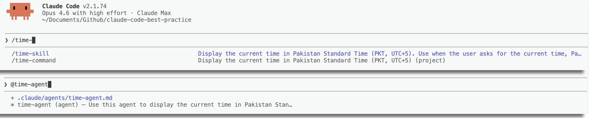
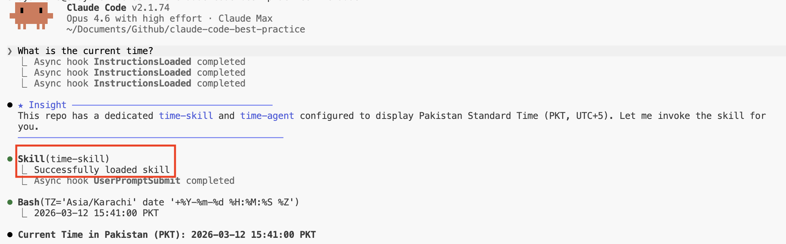

# Agent vs Command vs Skill — 何时使用什么

CodeBuddy Code 中三种扩展机制的比较：Subagent、Command 和 Skill。

<table width="100%">
<tr>
<td><a href="../">← 返回 CodeBuddy Code 最佳实践</a></td>
<td align="right"></td>
</tr>
</table>



---

## 一览

| | Agent | Command | Skill |
|---|---|---|---|
| **位置** | `.codebuddy/agents/<name>.md` | `.codebuddy/commands/<name>.md` | `.codebuddy/skills/<name>/SKILL.md` |
| **上下文** | 独立的子 Agent 进程 | 内联（主对话） | 内联（主对话） |
| **用户可调用** | 无 `/` 菜单 — 由 CodeBuddy 或通过 Agent 工具调用 | 是 — `/command-name` | 是 — `/skill-name`（除非 `user-invocable: false`） |
| **CodeBuddy 自动调用** | 是 — 通过 `description` 字段 | 否 | 是 — 通过 `description` 字段（除非 `disable-model-invocation: true`） |
| **接受参数** | 通过 `prompt` 参数 | `$ARGUMENTS`、`$0`、`$1` | `$ARGUMENTS`、`$0`、`$1` |
| **动态上下文注入** | 否 | 是 — `` !`command` `` | 是 — `` !`command` `` |
| **独立上下文窗口** | 是 — 隔离 | 否 — 共享主窗口 | 否 — 共享主窗口（除非 `context: fork`） |
| **模型覆盖** | `model:` frontmatter | `model:` frontmatter | `model:` frontmatter |
| **工具限制** | `tools:` / `disallowedTools:` | `allowed-tools:` | `allowed-tools:` |
| **Hooks** | `hooks:` frontmatter | — | `hooks:` frontmatter |
| **记忆** | `memory:` frontmatter（user/project/local） | — | — |
| **可预加载 Skill** | 是 — `skills:` frontmatter | — | — |
| **MCP 服务器** | `mcpServers:` frontmatter | — | — |

---

## 何时使用每种机制

### 使用 Agent 的场景：

- 任务是**自主且多步骤**的 — Agent 需要探索、决定和操作而无需持续指导
- 你需要**上下文隔离** — 工作不应污染主对话窗口
- Agent 需要跨会话的**持久记忆**（例如，学习模式的代码审查者）
- 你想通过 Skill **预加载领域知识**而不使主上下文混乱
- 任务受益于**在后台运行**或在 **git worktree** 中运行
- 你需要**工具限制**或**不同的权限模式**（例如 `acceptEdits`、`plan`）

**示例**：`weather-agent` — 使用其预加载的 `weather-fetcher` Skill 自主获取天气数据，在隔离的上下文中运行，工具受限。

### 使用 Command 的场景：

- 你需要一个**用户发起的入口点** — 用户明确触发的工作流
- 工作流涉及**编排**其他 Agent 或 Skill
- 你想**保持上下文精简** — Command 内容在用户触发之前不会注入会话上下文

**示例**：`weather-orchestrator` — 用户触发它，它询问 C/F 偏好，调用 Agent，然后调用 SVG Skill。

### 使用 Skill 的场景：

- 你想让 **CodeBuddy 根据用户意图自动调用** — Skill 描述被注入会话上下文以进行语义匹配
- 任务是**可复用的过程**，可以从多个地方调用（Command、Agent 或 CodeBuddy 本身）
- 你需要 **Agent 预加载** — 在启动时将领域知识嵌入特定 Agent

**示例**：`weather-svg-creator` — 当用户请求天气卡片时 CodeBuddy 自动调用它；也可从 Command 调用。

---

## Command → Agent → Skill 架构

此仓库演示了分层编排模式：

```
用户触发 /command
    ↓
Command 编排工作流
    ↓
Command 调用 Agent（独立上下文，自主）
    ↓
Agent 使用预加载的 Skill（领域知识）
    ↓
Command 调用 Skill（内联，用于输出生成）
```

**具体示例** — 天气系统：

```
/weather-orchestrator（Command — 入口点，询问 C/F）
    ↓
weather-agent（Agent — 自主获取温度）
    ├── weather-fetcher（Agent Skill — 预加载的 API 指令）
    ↓
weather-svg-creator（Skill — 内联创建 SVG）
```

---

## Frontmatter 比较

### Agent Frontmatter

```yaml
---
name: my-agent
description: 当需要主动执行时使用此智能体...
tools: Read, Write, Edit, Bash
model: sonnet
maxTurns: 10
permissionMode: acceptEdits
memory: user
skills:
  - my-skill
---
```

### Command Frontmatter

```yaml
---
description: Do something useful
argument-hint: [issue-number]
allowed-tools: Read, Edit, Bash(gh *)
model: sonnet
---
```

### Skill Frontmatter

```yaml
---
name: my-skill
description: 当用户请求...时执行相应操作
argument-hint: [file-path]
disable-model-invocation: false
user-invocable: true
allowed-tools: Read, Grep, Glob
model: sonnet
context: fork
agent: general-purpose
---
```

---

## 关键区别

### 自动调用

| 机制 | CodeBuddy 可以自动调用？ | 如何防止 |
|-----------|------------------------|----------------|
| Agent | 是 — 通过 `description`（使用 "PROACTIVELY" 来鼓励） | 删除或软化描述 |
| Command | 否 — 始终通过 `/` 用户发起 | 不适用 |
| Skill | 是 — 通过 `description` | 设置 `disable-model-invocation: true` |

### 在 `/` 菜单中的可见性

| 机制 | 出现在 `/` 菜单中？ | 如何隐藏 |
|-----------|---------------------|-------------|
| Agent | 否 | 不适用 |
| Command | 是 — 始终 | 无法隐藏 |
| Skill | 是 — 默认 | 设置 `user-invocable: false` |

### 上下文隔离

| 机制 | 在自己的上下文中运行？ | 如何配置 |
|-----------|---------------------|-----------------|
| Agent | 始终 | 内置行为 |
| Command | 从不 | 不适用 |
| Skill | 可选 | 设置 `context: fork` |

---

## 实际示例："现在几点了？"

此仓库为同一任务定义了所有三种机制 — 显示 PKT 时区的当前时间。以下是当用户输入 **"现在几点了？"** 而不显式调用任何 `/` 命令时的情况：

| 机制 | 会触发吗？ | 为什么 / 为什么不会 |
|-----------|--------------|---------------|
| `time-command` | 否 | Command **永远不自动调用**。用户需要显式输入 `/time-command` 才能运行。Command 没有自动发现路径 — 它们严格由用户发起。 |
| `time-agent` | **可能** | Agent 的 `description` 写着 *"Use this agent to display the current time in Pakistan Standard Time"*。CodeBuddy 将此与用户意图匹配，可能通过 Agent 工具生成它。但是，Agent 在**单独的上下文窗口**中运行，对于这个简单任务来说过于重量级。 |
| `time-skill` | **最可能** | Skill 的 `description` 写着 *"Display the current time in Pakistan Standard Time (PKT, UTC+5). Use when the user asks for the current time, Pakistan time, or PKT."* CodeBuddy 匹配此描述并通过 Skill 工具调用它。由于它**内联**运行且无上下文开销，这是最高效的匹配。 |

### 解析顺序

当多个机制匹配相同意图时，CodeBuddy 偏好满足请求的**最轻量选项**：

```
1. Skill（内联，无上下文开销）     ← 首选
2. Agent（独立上下文，自主）       ← 当 Skill 不可用或任务复杂时使用
3. Command（永远不 — 需要显式 /） ← 仅当用户输入 /time-command 时
```

### 如果在 Skill 上设置了 `disable-model-invocation: true` 会怎样？

那么 CodeBuddy **无法**自动调用该 Skill。Agent 成为唯一可自动调用的选项，所以 CodeBuddy 会改为生成 `time-agent` — 代价是为一个单行 bash 命令使用独立的上下文窗口。

### 如果 Skill 和 Agent 都禁用了自动调用呢？

那么**什么都不会自动触发**。CodeBuddy 会退回到其自身的通用知识，可能直接运行 `TZ='Asia/Karachi' date` — 不涉及任何扩展机制。用户需要显式输入 `/time-command` 或 `/time-skill` 来使用其中一个。



---

## 参考来源

- [CodeBuddy Code Skills — 文档](https://www.codebuddy.cn/docs/cli/en/skills)
- [CodeBuddy Code Sub-agents — 文档](https://www.codebuddy.cn/docs/cli/en/sub-agents)
- [CodeBuddy Code Slash Commands — 文档](https://www.codebuddy.cn/docs/cli/en/slash-commands)
- [Skills 最佳实践](../best-practice/codebuddy-skills.md)
- [Commands 最佳实践](../best-practice/codebuddy-commands.md)
- [Sub-agents 最佳实践](../best-practice/codebuddy-subagents.md)
