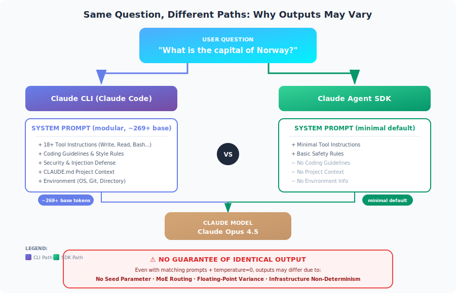

# CodeBuddy Agent SDK vs CodeBuddy CLI：系统提示与输出一致性

<table width="100%">
<tr>
<td><a href="../">← 返回 CodeBuddy Code 最佳实践</a></td>
<td align="right"></td>
</tr>
</table>



---

## 摘要

当通过 **CodeBuddy Agent SDK** 和 **CodeBuddy CLI (CodeBuddy Code)** 发送相同的消息（例如，"挪威的首都是什么？"）时，附带的系统提示有根本性的不同。CLI 使用**模块化系统提示架构**（约 269 个基础 Token，并根据功能条件加载额外上下文），而 SDK 默认使用最小化提示。**两者之间无法保证输出完全一致**，即使配置匹配，因为 CodeBuddy 架构中不存在 seed 参数且存在固有的非确定性。

---

## 1. 系统提示对比

### CodeBuddy CLI (CodeBuddy Code)

CodeBuddy CLI 使用**模块化系统提示架构**，基础提示约 269 个 Token，并条件加载额外上下文：

| 组件 | 描述 | 加载方式 |
|------|------|---------|
| **基础系统提示** | 核心指令和行为 | 始终加载（约 269 个 Token） |
| **工具指令** | 18+ 内置工具（Write、Read、Edit、Bash、TodoWrite 等） | 始终加载 |
| **编码指南** | 代码风格、格式化规则、安全实践 | 始终加载 |
| **安全规则** | 拒绝规则、注入防御、伤害预防 | 始终加载 |
| **响应风格** | 语气、详细程度、解释深度、表情符号使用 | 始终加载 |
| **环境上下文** | 工作目录、Git 状态、平台信息 | 始终加载 |
| **项目上下文** | CODEBUDDY.md 内容、设置、Hooks 配置 | 条件加载 |
| **Subagent 提示** | 计划模式、探索 Agent、任务 Agent | 条件加载 |
| **安全审查** | 扩展安全指令（约 2,610 个 Token） | 条件加载 |

**关键特征：**
- **模块化架构**，110+ 个系统提示字符串条件加载
- 基础提示适中（约 269 个 Token），总量随激活的功能变化
- 包含广泛的安全和注入防御层
- 自动加载工作目录中的 CODEBUDDY.md 文件
- 交互模式下的会话持久化上下文

### CodeBuddy Agent SDK

Agent SDK 默认使用**最小化系统提示**，包含：

| 组件 | 描述 | Token 影响 |
|------|------|-----------|
| **基本工具指令** | 仅显式提供的工具 | 极少 |
| **基本安全** | 最少的安全指令 | 极少 |

**关键特征：**
- 默认无编码指南或风格偏好
- 除非显式配置，否则无项目上下文
- 无详细工具描述
- 需要显式配置才能匹配 CLI 行为

---

## 2. 各接口发送的内容

### 示例："挪威的首都是什么？"

#### 通过 CodeBuddy CLI

```
系统提示：[模块化，约 269+ 基础 Token]
├── 基础系统提示（约 269 个 Token）
├── 工具指令（Write、Read、Edit、Bash、Grep、Glob 等）
├── Git 安全协议
├── 代码引用指南
├── 专业客观性指令
├── 安全和注入防御规则
├── 环境上下文（操作系统、目录、日期）
├── CODEBUDDY.md 内容（如果存在）[条件加载]
├── MCP 工具描述（如果已配置）[条件加载]
├── 计划/探索模式提示 [条件加载]
└── 会话/对话上下文

用户消息："挪威的首都是什么？"
```

#### 通过 CodeBuddy Agent SDK（默认）

```
系统提示：[最小化]
├── 基本工具指令（如果有提供工具）
└── 基本操作上下文

用户消息："挪威的首都是什么？"
```

#### 通过 Agent SDK（使用 `codebuddy_code` 预设）

```typescript
const response = await query({
  prompt: "挪威的首都是哪里？",
  options: {
    systemPrompt: {
      type: "preset",
      preset: "codebuddy_code"
    }
  }
});
```

```
系统提示：[模块化，匹配 CLI]
├── 完整的 CodeBuddy Code 系统提示
├── 工具指令
├── 编码指南
└── 安全规则

// 注意：除非配置了 settingSources，否则仍不包含 CODEBUDDY.md
```

---

## 3. 自定义方法

### CodeBuddy CLI 自定义

| 方法 | 命令 | 效果 |
|------|------|------|
| **追加提示** | `codebuddy -p "..." --append-system-prompt "..."` | 添加指令同时保留默认值 |
| **替换提示** | `codebuddy -p "..." --system-prompt "..."` | 完全替换系统提示 |
| **项目上下文** | CODEBUDDY.md 文件 | 自动加载，持久化 |
| **输出风格** | `/output-style [name]` | 应用预定义的响应风格 |

### Agent SDK 自定义

| 方法 | 配置 | 效果 |
|------|------|------|
| **自定义提示** | `systemPrompt: "..."` | 完全替换默认值（失去工具） |
| **预设 + 追加** | `systemPrompt: { type: "preset", preset: "codebuddy_code", append: "..." }` | 保留 CLI 功能 + 自定义指令 |
| **加载 CODEBUDDY.md** | `settingSources: ["project"]` | 加载项目级指令 |
| **输出风格** | `settingSources: ["user"]` 或 `settingSources: ["project"]` | 加载已保存的输出风格 |

### 配置对比表

| 功能 | CLI 默认 | SDK 默认 | SDK 使用预设 |
|------|---------|---------|-------------|
| 工具指令 | ✅ 完整 | ❌ 最少 | ✅ 完整 |
| 编码指南 | ✅ 有 | ❌ 无 | ✅ 有 |
| 安全规则 | ✅ 有 | ❌ 基本 | ✅ 有 |
| CODEBUDDY.md 自动加载 | ✅ 是 | ❌ 否 | ❌ 否* |
| 项目上下文 | ✅ 自动 | ❌ 无 | ❌ 无* |

*需要显式配置 `settingSources: ["project"]`

---

## 4. 输出一致性保证

### 关键发现：不保证确定性

**CodeBuddy Messages API 不提供用于可重现性的 seed 参数。** 这是一个根本性的架构限制。

### 阻止相同输出的因素

| 因素 | 描述 | 可控？ |
|------|------|--------|
| **不同的系统提示** | CLI 和 SDK 默认值不同 | ✅ 是（通过配置） |
| **浮点运算** | 并行硬件的特性 | ❌ 否 |
| **MoE 路由** | Mixture-of-Experts 架构变化 | ❌ 否 |
| **批处理/调度** | 云基础设施差异 | ❌ 否 |
| **数值精度** | 推理引擎变化 | ❌ 否 |
| **模型快照** | 版本更新/变更 | ❌ 否 |

### Temperature 和采样

即使设置 `temperature=0.0`（贪心解码）：
- **不保证**完全确定性
- 由于基础设施因素，仍可能出现微小差异
- 已知问题：[CodeBuddy CLI 对相同输入产生非确定性输出](https://github.com/anthropics/codebuddy-code/issues/3370)

---

## 5. 实现最大一致性

要获得 SDK 和 CLI 之间**尽可能接近**的相同输出：

### Agent SDK 配置

```typescript
import CodeBuddy from "@codebuddy-ai/sdk";

const client = new CodeBuddy();

// 选项 1：使用 codebuddy_code 预设
const response = await client.messages.create({
  model: "codebuddy-sonnet-4-20250514",
  max_tokens: 1024,
  // 尽可能匹配 CLI 系统提示
  system: "Your exact system prompt matching CLI",
  messages: [
    { role: "user", content: "What is the capital of Norway?" }
  ],
  // 使用贪心解码以获得最大一致性
  temperature: 0
});

// 选项 2：使用 Agent SDK query 函数
import { query } from "@codebuddy-ai/agent-sdk";

for await (const message of query({
  prompt: "What is the capital of Norway?",
  options: {
    systemPrompt: {
      type: "preset",
      preset: "codebuddy_code"
    },
    temperature: 0,
    model: "codebuddy-sonnet-4-20250514",
    // 像 CLI 一样加载项目上下文
    settingSources: ["project"]
  }
})) {
  // 处理响应
}
```

### CLI 配置

```bash
# 尽可能匹配 SDK 配置
codebuddy -p "What is the capital of Norway?" \
  --model codebuddy-sonnet-4-20250514 \
  --temperature 0
```

### 仍然无法保证

即使配置完全匹配：
- 不同次运行的输出可能不同
- SDK 和 CLI 之间的输出可能不同
- 不存在用于强制可重现性的 seed 参数

---

## 6. 实际影响

### 何时使用哪个接口

| 使用场景 | 推荐接口 | 原因 |
|----------|---------|------|
| 交互式开发 | CodeBuddy CLI | 完整工具套件，项目上下文 |
| 程序化集成 | Agent SDK | 细粒度控制，可嵌入 |
| 一致的 API 响应 | Agent SDK + 自定义提示 | 对系统提示有更多控制 |
| 批处理 | Agent SDK | 更适合自动化流水线 |
| 一次性任务 | CodeBuddy CLI | 设置更快，即时上下文 |

### 设计建议

1. **不要依赖逐位完全可重现性**
   - 构建对微小输出变化具有鲁棒性的应用
   - 使用结构化输出和验证

2. **对于需要一致性的生产流水线：**
   - 尽可能缓存结果
   - 使用带有 JSON Schema 验证的结构化输出
   - 结合确定性逻辑和验证
   - 考虑多次生成取共识

3. **在 SDK 中匹配 CLI 行为：**
   ```typescript
   systemPrompt: {
     type: "preset",
     preset: "codebuddy_code",
     append: "Your additional instructions"
   },
   settingSources: ["project", "user"]
   ```

---

## 7. 系统提示 Token 影响

| 配置 | 架构 | 说明 |
|------|------|------|
| SDK（最小化） | 最小化默认 | 仅基本工具指令 |
| SDK（codebuddy_code 预设） | 模块化（约 269+ 基础） | 匹配 CLI，随功能变化 |
| CLI（默认） | 模块化（约 269+ 基础） | 条件加载额外上下文 |
| CLI（带 MCP 工具） | 模块化 + MCP | MCP 工具描述增加显著 Token |

**注意：** CodeBuddy Code 使用模块化架构，包含 110+ 个系统提示字符串。基础提示约 269 个 Token，单个组件根据激活的功能从 18 到 2,610 个 Token 不等。

**影响：** SDK 的最小化默认值为实际任务留出更多上下文，但代价是失去 CodeBuddy Code 的完整功能。

---

## 8. 摘要表

| 方面 | CodeBuddy CLI | Agent SDK（默认） | Agent SDK（预设） |
|------|------------|------------------|------------------|
| **系统提示** | 模块化（约 269+ 基础） | 最小化 | 模块化（匹配 CLI） |
| **包含工具** | 18+ 内置 | 仅在提供时 | 18+ 内置 |
| **CODEBUDDY.md 自动加载** | 是 | 否 | 否（需配置） |
| **编码指南** | 是 | 否 | 是 |
| **安全规则** | 完整 | 基本 | 完整 |
| **Temperature 控制** | 是 | 是 | 是 |
| **确定性保证** | 否 | 否 | 否 |
| **输出相同？** | 不适用 | 否（与 CLI 比较） | 更接近，但不是 |

---

## 9. 结论

**问：SDK 和 CLI 中同一消息伴随什么系统提示？**

CLI 使用**模块化系统提示架构**，基础提示约 269 个 Token，包含 110+ 个条件加载的组件（工具指令、编码指南、安全规则、项目上下文）。SDK 默认使用**最小化提示**，仅包含基本工具指令，但可以通过 `codebuddy_code` 预设配置为匹配 CLI 行为。

**问：是否保证输出相同？**

**不保证。** 即使系统提示匹配、输入相同且 `temperature=0`，由于以下原因也无法保证输出相同：
- CodeBuddy API 中不存在 seed 参数
- 浮点运算差异
- 基础设施级别的非确定性
- 模型架构（Mixture-of-Experts）路由差异

**建议：** 设计系统时应使其对输出变化具有鲁棒性，而非依赖确定性行为。对于一致性要求高的应用，使用结构化输出、缓存和验证层。

---

## 参考来源

- [修改系统提示 — Agent SDK](https://docs.anthropic.com/en/docs/agents-and-tools/codebuddy-code/sdk#modifying-system-prompts)
- [CodeBuddy Code CLI 参考](https://docs.anthropic.com/en/docs/agents-and-tools/codebuddy-code/cli)
- [CodeBuddy Code 无头模式](https://docs.anthropic.com/en/docs/agents-and-tools/codebuddy-code/headless)
- [CodeBuddy Code 最佳实践 — Anthropic 工程](https://www.anthropic.com/engineering/codebuddy-code-best-practices)
- [CodeBuddy Messages API 参考](https://docs.anthropic.com/en/api/messages)
- [GitHub Issue #3370：非确定性输出](https://github.com/anthropics/codebuddy-code/issues/3370)
- [CodeBuddy Code 系统提示仓库](https://github.com/Piebald-AI/codebuddy-code-system-prompts) — 模块化提示架构分析
- [为什么 LLM 的确定性输出几乎不可能](https://unstract.com/blog/understanding-why-deterministic-output-from-llms-is-nearly-impossible/)

---

*本报告由 CodeBuddy Code 使用 Opus 4.5 模型于 2026 年 2 月 3 日生成。*
