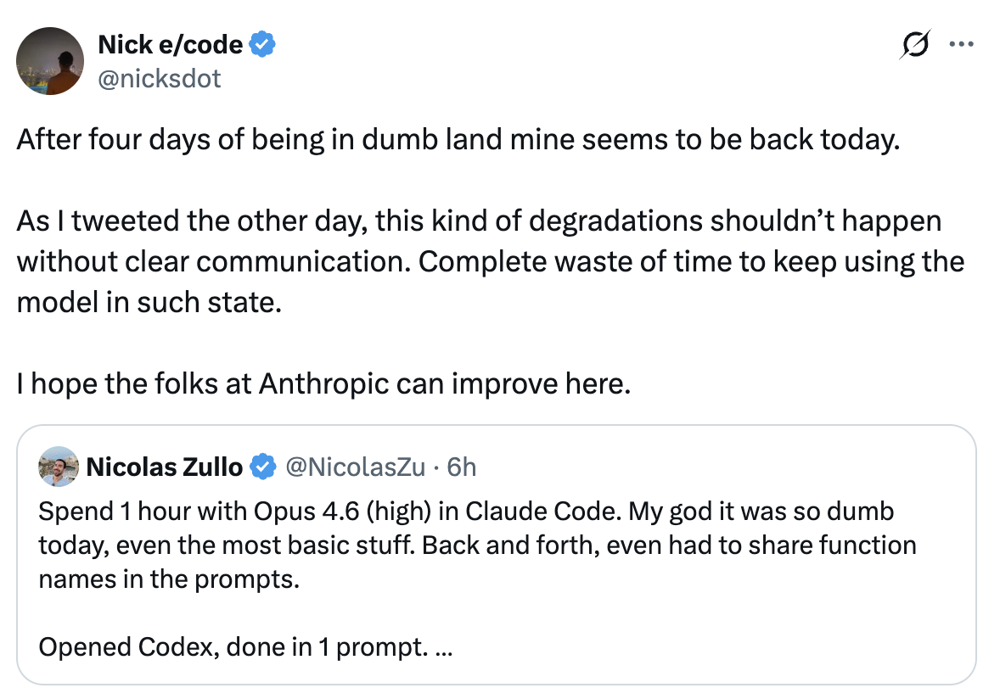

# LLM 日常性能退化：神话与现实

即使模型权重已冻结，已部署的 LLM 性能也会日复一日地发生变化吗？深入探讨已证实的原因、基础设施缺陷和心理因素。

<table width="100%">
<tr>
<td><a href="../">← 返回 CodeBuddy Code 最佳实践</a></td>
<td align="right"></td>
</tr>
</table>

---

<table width="100%">
<tr>
<td width="50%"><a href="https://x.com/nicksdot/status/2029520949176049704"></a></td>
<td width="50%"><a href="https://x.com/levelsio/status/2029369159893569680"></a></td>
</tr>
</table>

---

---

# 🔥 CodeBuddy Code Opus 4.6 分析 — 高级推理

当 Anthropic 发布如 Opus 4.6 这样的模型时，**模型权重**——数十亿个学习到的参数——是冻结的。训练成本极其高昂（数百万美元，数周的计算资源）。没有人会在一夜之间重新训练模型。

但权重只是一个更大系统中的一层。研究表明，即使模型权重冻结，至少有 **7 种不同的机制** 可能导致真实的或感知到的质量变化。

| 问题 | 回答 |
|------|------|
| 模型发布后权重会变化吗？ | **不会** — 所有提供商均已确认 |
| 模型日复一日的表现会不同吗？ | **会** — 已证实存在 ±8-14% 的方差 |
| 这是故意的"削弱"吗？ | **不是** — 没有证据表明存在蓄意退化 |
| 基础设施缺陷是真实存在的吗？ | **是的** — Anthropic 确认了 3 个影响高达 16% 请求的缺陷 |
| 部分是心理因素吗？ | **是的** — 确认偏误和蜜月效应是真实存在的 |
| 系统提示词/后训练会变化吗？ | **会** — 各提供商均有记录 |
| 用户应该信任自己的感知吗？ | **部分应该** — 存在真实原因，但感知会放大这些原因 |

---

## 完整推理栈

模型权重是冻结的，但**其上方的九个层**可以独立地影响你的体验：

```
┌──────────────────────────────────────────────┐
│  你的会话上下文                                │  ← 会话内退化
│  （累积的错误、长对话）                        │
├──────────────────────────────────────────────┤
│  系统提示词                                    │  ← 定期更新
│  （安全规则、行为指令）                        │
├──────────────────────────────────────────────┤
│  后训练（RLHF / 微调）                        │  ← 可能悄然更新
│  （指令遵循、安全对齐）                        │
├──────────────────────────────────────────────┤
│  采样参数                                      │  ← 可在服务端调优
│  （temperature、top-p、top-k）                 │
├──────────────────────────────────────────────┤
│  推测解码                                      │  ← 草稿模型质量不一
│  （草稿模型预测 + 验证）                       │
├──────────────────────────────────────────────┤
│  MoE 路由 / 批次组成                           │  ← 已证实 ±8-14% 方差
│  （每个请求激活哪些专家）                      │
├──────────────────────────────────────────────┤
│  硬件路由                                      │  ← TPU vs GPU vs Trainium
│  （哪个集群处理你的请求）                      │
├──────────────────────────────────────────────┤
│  量化级别                                      │  ← 负载下可能变化
│  （FP16 vs INT8 vs INT4 精度）                 │
├──────────────────────────────────────────────┤
│  编译器和运行时                                │  ← XLA 缺陷已被证实
│  （XLA:TPU、CUDA、特定硬件代码）               │
├──────────────────────────────────────────────┤
│  模型权重（已冻结）                            │  ← 这些不会变化
│  （数十亿个学习到的参数）                      │
└──────────────────────────────────────────────┘
```

关键心智模型：**冻结的权重 ≠ 冻结的行为**。这就像说"同一引擎 = 同样的驾驶体验"，却忽略了轮胎、路况、燃油质量和驾驶疲劳。

---

## 已证实的原因：基础设施缺陷

### Anthropic 的 2025 年 9 月事后分析

2025 年 9 月，Anthropic 发布了详细的事后分析，揭示了在 2025 年 8 月至 9 月期间降低 Claude 质量的**三个独立基础设施缺陷**。其官方声明：

> "我们从不因需求量、时段或服务器负载而降低模型质量。用户报告的问题完全是由基础设施缺陷引起的。"

### 缺陷 #1 — 上下文窗口路由错误

Sonnet 4 请求被意外路由到配置为 100 万 token 上下文窗口的服务器，而非标准服务器。

- **时间线**：8 月 5 日引入，8 月 29 日在负载均衡变更后恶化
- **峰值影响**：最严重时（8 月 31 日）16% 的 Sonnet 4 请求受到影响
- **用户影响**：约 30% 的 CodeBuddy Code 用户至少有一条消息质量下降
- **隐蔽细节**：路由是"粘性的"——一旦命中了问题服务器，后续请求会继续发往该服务器
- **修复**：9 月 4-18 日（跨平台逐步推出）

### 缺陷 #2 — TPU 输出损坏

TPU 服务器上的配置错误导致 token 生成过程中出现错误，为本应极少出现的 token 赋予了高概率。

- **症状**：英文回复中出现泰文或中文字符，明显的代码语法错误
- **影响范围**：Opus 4.1 和 Opus 4（8 月 25-28 日），Sonnet 4（8 月 25 日至 9 月 2 日）
- **范围**：仅 Claude API；第三方平台未受影响
- **修复**：9 月 2 日回滚

### 缺陷 #3 — XLA:TPU 编译器错误编译（最严重的）

一次修复精度问题的代码变更意外暴露了 Google XLA:TPU 中一个**潜在的编译器缺陷**。

- **根本原因**：近似 top-k 操作（用于选择最可能的下一个 token）"有时返回完全错误的结果，但仅在特定批次大小和模型配置下"
- **难以发现的原因**：其行为取决于之前或之后运行了哪些操作，以及是否启用了调试工具
- **隐藏数月**：2024 年 12 月的一个先前的解决方案意外掩盖了这个更深层的缺陷
- **影响范围**：确认影响 Haiku 3.5；怀疑影响 Sonnet 4 和 Opus 3 的子集
- **解决方案**：从近似 top-k 切换到精确 top-k；接受"轻微的效率影响"，因为"模型质量是不可妥协的"

### 检测困难的原因

Anthropic 自己的自动化评估没有捕捉到用户报告的退化，"部分原因是 Claude 通常能很好地从孤立错误中恢复。"每个缺陷在不同平台上以不同速率产生不同症状，造成了"指向多个原因的令人困惑的报告混合"。

关键背景：Claude 运行在**三种不同的硬件平台**上（AWS Trainium、NVIDIA GPU、Google TPU），每种都有不同的故障模式、编译器和精度行为。你的请求在不同日期可能命中不同的硬件。

---

## 已证实的原因：MoE 路由方差

现代大型模型通常使用**混合专家（MoE）**架构，其中只有模型参数的一个子集（"专家"）对每个输入进行激活。学习到的路由器决定使用哪些专家。

Scale AI 的研究揭示了一个关键发现：

> "稀疏 MoE 和批量推理的结合产生了不可预测的结果，因为批次的组成可以决定你的查询被路由到哪个专家，而同一批次中来自其他用户的查询组合不是确定性的。"

### 跨提供商测量的日常方差

| 提供商 | 日常分数方差 |
|--------|-------------|
| OpenAI（GPT-4 变体） | ±10–12% |
| Anthropic（Claude 变体） | ±8–11% |
| Google（Gemini 变体） | ±9–14% |

具体例子：同一模型在某天的越狱抵抗力评分为 **77%，第二天为 63%**。相同的模型、相同的权重、相同的测试——仅基础设施就导致了 14 个百分点的波动。

这意味着即使零缺陷、零变更，同一模型在不同日期也可能产生明显不同的输出质量，纯粹是因为请求的批处理和路由方式不同。当日常噪声为 10-15% 时，A/B 测试无法可靠地检测到 5% 的质量信号。

---

## 已证实的原因：系统提示词与后训练更新

### 系统提示词变化

模型权重不变，但包裹这些权重的**系统提示词**可以随时更新。对 Claude 系统提示词演变的分析显示了数十次迭代，其中"热修复"——为修补不良行为而添加的简短指令——被定期添加和移除。

Claude 3.7 的系统提示词包含多个针对常见 LLM "陷阱"的热修复指令。Claude 4.0 的系统提示词移除了所有这些指令，改为在后训练中通过强化学习来解决这些行为。

### 后训练理论

对于无法解释的质量变化，最可信的理论是：公司可以在不改变基础模型权重的情况下更新**微调和 RLHF**（基于人类反馈的强化学习）。这在技术上可以在说"模型没有变化"的同时，通过更新的安全护栏和指令遵循调整来改变行为。

---

## 已证实的原因：静默模型替换

OpenAI 被多次记录到静默更改用户交互的模型：

- 一夜之间移除模型选择器，强制用户从 GPT-4o 转到 GPT-5
- 将 GPT-4o 设为隐藏的"旧版模型"，需要在设置中手动切换，无应用内通知
- 一个"自动切换器"缺陷将用户路由到错误模型
- Plus 订阅者报告模型未经同意切换到"受限版本"

Sam Altman 承认推出过程"比我们希望的稍微颠簸一些。" Reddit 帖子获得了数千个点赞，称新模型是"灾难"和"降级"。

这证明模型替换**确实在行业中发生**——有时是故意的（产品决策），有时是意外的（路由缺陷）。

---

## 加剧因素

### 负载下的量化

为了以经济高效的方式服务数百万用户，公司可能会提供模型的**量化**版本——将精度从 FP16 降低到 INT8 或 INT4。这可以将内存使用减少 2-4 倍并加速推理，但会引入微妙的质量损失。提供商是否在负载下动态切换量化级别仍有争议，但技术能力确实存在，并在 vLLM 和 TensorRT 等服务框架中有充分记录。

### 推测解码

现代服务栈使用较小的"草稿"模型来预测多个 token，然后让真实模型进行验证。理论上这保持了相同的输出分布，但在实践中接受率因领域和上下文而异。开箱即用的草稿模型在某些情况下可能工作良好，但通常在特定领域任务或非常长的上下文中表现不佳。

### 上下文窗口污染

在长时间编码会话中，早期错误会在上下文中累积。模型看到自己的错误并可能延续它们。这是单个会话内"Claude 变笨了"最常见的原因——不是模型退化了，而是上下文被污染了。

**实用技巧**：当感觉质量下降时使用 `/compact` 或开启新的会话。这是你能做的最有用的事情。

---

## 斯坦福研究——以及为什么它很复杂

斯坦福大学和加州大学伯克利分校 2023 年的里程碑研究（Chen、Zaharia、Zou）——"ChatGPT 的行为如何随时间变化？"——经常被引用为 LLM 退化的证据。主要发现：

> GPT-4 在"这个数字是质数吗？逐步思考"上的准确率从 2023 年 3 月的 **97.6% 下降到 6 月的 2.4%**。

### 该研究证明了什么

- "相同"LLM 服务的行为**可以在短时间内发生重大变化**
- 不同能力可能朝相反方向移动（GPT-4 数学变差了，GPT-3.5 变好了）
- 代码生成质量下降（GPT-4 可执行代码：52% → 10%）
- 该研究创造了**"LLM 漂移"**这一术语

### 方法论批评

- 3 月版本使用 **temperature 0.0**，而 6 月版本使用 **temperature 1.0**——这是一个增加随机性的根本性混淆变量
- 每个任务仅 **500 次查询**——统计样本太小，无法得出确切结论
- "数学问题"实际上是是/否问题，模型的猜测模式改变了，而非数学能力
- 变化可能反映了有意的**后训练安全更新**，而非退化

该研究证明了一件重要的事情——LLM 行为会随时间变化——但机制很可能是有意的更新，而非无意的退化。

---

## 心理因素

### 确认偏误

一旦有人发推说"Claude 今天很笨"，你就开始注意到每一个错误。在没有人抱怨的日子里，你会忽略同样的错误。社交媒体放大了这种效应。

### 蜜月效应

用户在使用新模型时经历一个初始蜜月期，然后逐渐发现局限性。模型没有改变——期望上升的速度超过了能力的增长。

### 任务难度方差

你的任务每天都在变化。一天的难题会让人觉得模型变差了，即使它没有。

### "周末 Claude"神话

尽管许多用户相信存在星期几的模式，但严谨的分析发现**没有一致的证据**支持星期几的质量模式。一篇标题为"AI 在周一更笨"的分析一无所获。

### LLM 的随机性

LLM 是概率性的。相同的提示每次可以产生不同的输出。在运气不好的时候，你可能连续得到几个糟糕的回复——纯粹是随机性，而非退化。

---

## 结论

用户描述的现象是**真实但归因错误的**：

- **正确的**：他们在某些天的体验确实退化了
- **错误的**：模型被故意"削弱"了

实际原因是以下因素的组合：

1. **基础设施缺陷** — Anthropic 的事后分析证实（高达 16% 的请求受影响）
2. **MoE 路由方差** — Scale AI 测量的 ±8-14% 质量波动，即使零变更
3. **系统提示词和后训练更新** — 各提供商均有记录
4. **硬件异构性** — TPU vs GPU vs Trainium，每种有不同的故障模式
5. **上下文污染** — 长会话内质量退化
6. **确认偏误** — 社交媒体放大感知到的模式
7. **随机方差** — 相同模型、相同提示、每次输出都不同

测量问题非常严重：±8-14% 的日常方差意味着你无法区分真实的 5% 质量变化和噪声。这就是为什么"都是你的幻觉"和"他们削弱了它"两个阵营都充满信心——信噪比使得仅凭个人经验无法判断。

---

## 来源

- [Anthropic: Three Recent Issues 事后分析](https://www.anthropic.com/engineering/a-postmortem-of-three-recent-issues) — 详述三个基础设施缺陷的官方事后分析（2025 年 9 月）
- [Anthropic 揭示三个基础设施缺陷 — InfoQ](https://www.infoq.com/news/2025/10/anthropic-infrastructure-bugs/) — 事后分析的技术分析
- [ChatGPT 的行为如何随时间变化？ — 斯坦福/加州大学伯克利分校](https://arxiv.org/abs/2307.09009) — LLM 漂移的里程碑研究（2023 年）
- [ChatGPT 能力退化的真相 — TechTalks](https://bdtechtalks.com/2023/07/24/chatgpt-capabilities-degrading-study/) — 对斯坦福研究的方法论批评
- [LLM 越来越笨了而我们不知道为什么 — Ignorance.ai](https://www.ignorance.ai/p/llms-are-getting-dumber-and-we-have) — 感知退化的五种理论
- [当 Claude 忘记如何编码 — Robert Matsuoka](https://hyperdev.matsuoka.com/p/when-claude-forgets-how-to-code) — Claude 质量波动和基础设施原因分析
- [平滑 LLM 方差 — Scale AI](https://scale.com/blog/smoothing-out-llm-variance) — 跨提供商测量的 ±8-14% 日常方差
- [从 Anthropic 系统提示词更新中学到什么 — PromptLayer](https://blog.promptlayer.com/what-we-can-learn-from-anthropics-system-prompt-updates/) — 系统提示词演变分析
- [Claude 系统提示词变化揭示 Anthropic 的优先级 — Drew Breunig](https://www.dbreunig.com/2025/06/03/comparing-system-prompts-across-claude-versions.html) — 系统提示词中的热修复模式
- [关于秘密切换模型的投诉 — OpenAI Forum](https://community.openai.com/t/complaints-about-secretly-switching-models/1360150) — 记录的静默模型替换
- [推测解码 — BentoML LLM 推理手册](https://bentoml.com/llm/inference-optimization/speculative-decoding) — 草稿模型如何影响服务
- [混合专家的可视化指南 — Maarten Grootendorst](https://newsletter.maartengrootendorst.com/p/a-visual-guide-to-mixture-of-experts) — MoE 架构和路由详解

---

---

# 🔥 Codex 5.3 高级推理与发现

### 报告范围

本节解释为什么用户可能会经历一个短暂窗口期，其中 Claude 输出质量下降，而 Codex 5.3 在编码任务上感觉稳定或更强。重点不在于永久性模型质量排名，而在于真实服务条件下的短期生产行为。

报告日期：2026 年 3 月 5 日。

### 观察到的模式

所报告的模式是：

1. 模型质量在一段时间内是可接受的。
2. 质量似乎在几天内下降。
3. 质量恢复到之前的基线水平。

这种形态通常是服务栈或推出模式，而非永久性的基础模型能力变化。永久性能力下降通常不会在没有显式回滚或修复的情况下如此快速恢复。

### 高级推理：为什么 Codex 5.3 在糟糕窗口期看起来更好

Codex 5.3 在另一个提供商的退化期可能看起来明显更强，这有几个技术原因，且这些原因可以同时发生：

1. **产品目标匹配度**。Codex 5.3 针对代码生成和 agent 编码工作流进行了优化，因此即使原始模型能力相同，由于工具编排、仓库推理和以代码为中心的指令调优，也能产生更好的编码结果。
2. **推理策略差异**。提供商独立调优延迟、推理深度和解码默认值。一个提供商的更保守策略在同一天看起来可能比另一个提供商的激进速度优化策略更"智能"。
3. **服务路径分离**。即使两个提供商托管最先进的模型，它们运行的路由层、编译器/运行时栈和推出管道也不同。一个栈中的事件不意味着另一个栈中的相关退化。
4. **推出和回滚时机**。如果一个提供商正在推出中而另一个是稳定的，用户可以看到很大的临时质量差异，而底层模型权重没有长期变化。
5. **会话级污染效应**。在长编码对话中，错误累积会放大感知到的下降。竞争助手可能感觉更好，仅仅是因为失败的会话被重置了，或者因为其工具循环恢复更快。

### 详细发现

对于"Claude 大约四天感觉很弱，然后恢复了"这样的报告，最可能的解释是：

1. 提供商端事件、路由问题、解码/运行时缺陷或推出回归影响了一部分请求。
2. 问题持续了足够长的时间，在真实工作流中被反复注意到。
3. 问题被修复或回滚。
4. 感知到的质量迅速恢复。

在同一时期，Codex 5.3 可能感觉明显更好，因为它没有共享相同的事件路径，且编码任务的优化放大了实际结果中的差距。

### 此模式的假设排序

| 假设 | 可能性 | 理由 |
|------|--------|------|
| 提供商事件加回滚 | 高 | 最符合多天下降后快速恢复的模式 |
| 服务配置变更（采样/延迟/推理预算） | 高 | 无模型重训练时突然行为变化的常见来源 |
| 静默别名或快照移动 | 中高 | 可在无可见用户操作的情况下改变行为 |
| 仅提示漂移和上下文污染 | 中 | 可使会话退化，但不太可能单独解释广泛的多天报告 |
| 永久性基础模型退化 | 低 | 与快速恢复到之前质量不一致 |

### 如何证实或证伪此发现

要将此从高置信度推断转变为确凿证据，需要跨天收集同一任务集的请求级遥测数据：

1. 请求时的精确模型标识符和快照/别名。
2. 提供商暴露的任何后端指纹或发布标记。
3. 解码参数（temperature、top_p、top_k、最大 token 数）。
4. 延迟、超时和错误率跟踪。
5. 固定编码基准提示集上的结构化质量分数。
6. 故障点的会话长度和 token 上下文深度。

如果质量下降与事件窗口、配置变更或后端指纹转移相关，则事件/配置假设得到证实。如果不存在此类变化且退化仅出现在长会话中，则上下文污染成为主要解释。

### 实用工程指导

为减少生产中的日常方差：

1. 在可用时固定模型快照，而非使用浮动别名。
2. 存储请求元数据（模型 ID、参数、延迟、错误、响应质量标签）。
3. 每天运行固定的编码任务金丝雀套件，并在回归时告警。
4. 在多次失败回合后重置或压缩长时间运行的会话。
5. 为事件窗口期保留备用提供商/模型路径。
6. 在内部仪表板中将"模型质量"与"服务可靠性"分开。

### 最终结论

Codex 5.3 在短暂的 Claude 退化窗口期看起来更好是现代 LLM 运营中一个技术上合理且预期的结果。最有力的解释不是永久性模型崩溃，而是一个提供商的临时服务路径退化，结合了另一个提供商同期的编码特定优化和稳定运行。
