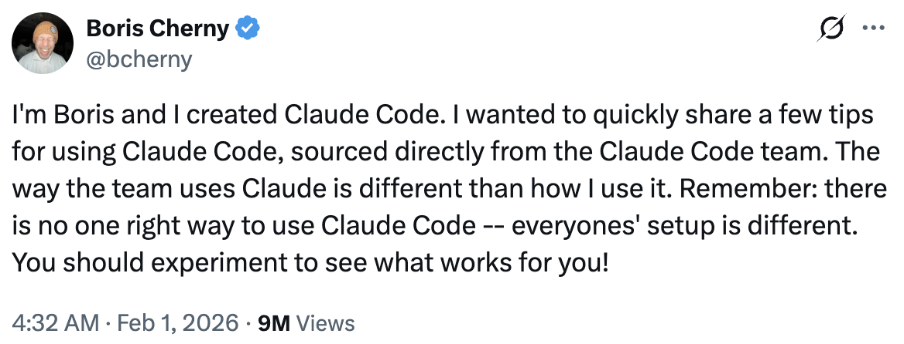
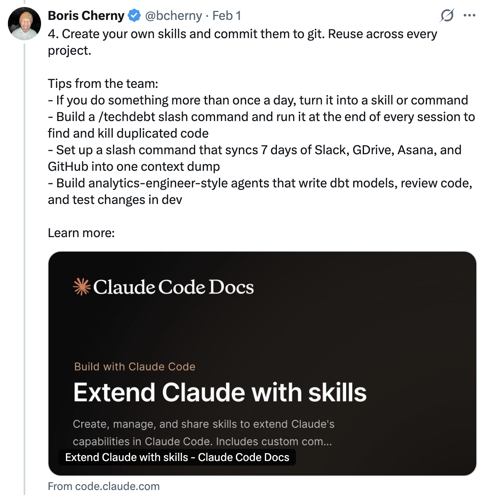
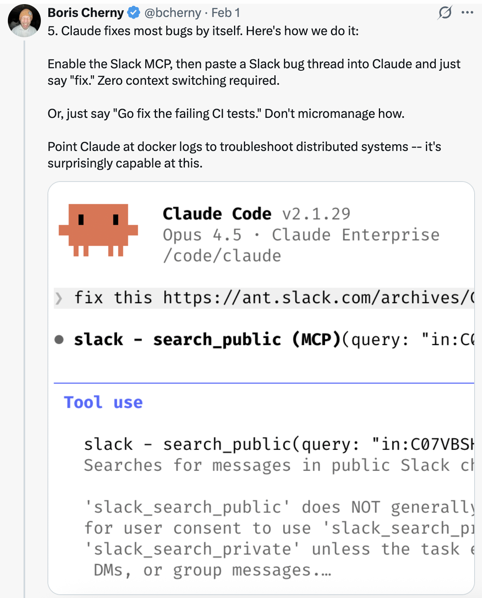
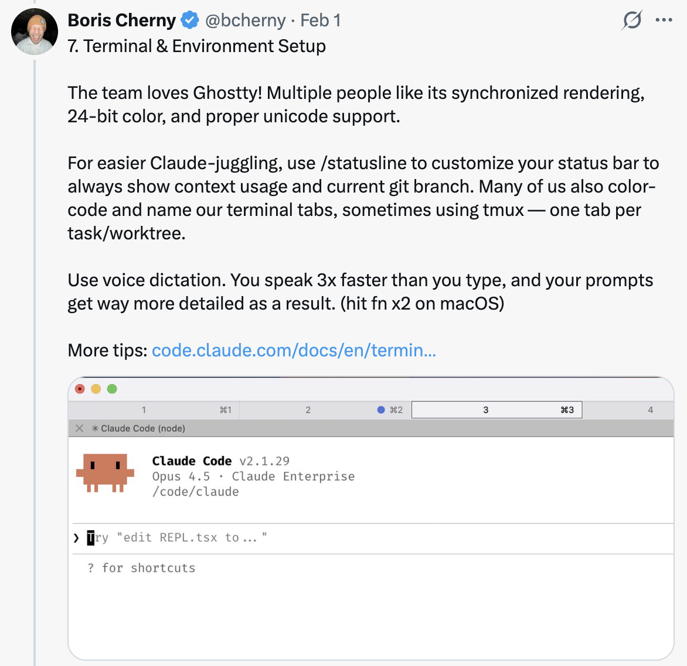
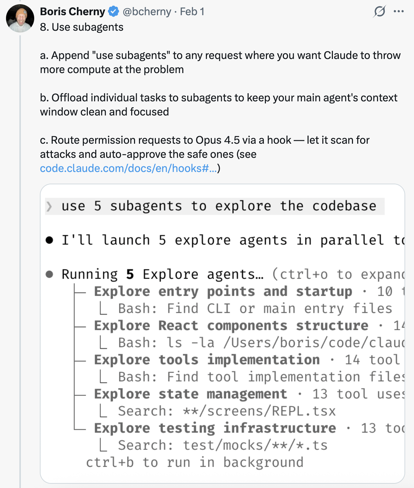

# 10 CodeBuddy Code 使用技巧 — 来自 CodeBuddy Code 团队

CodeBuddy Code 创建者 Boris Cherny ([@bcherny](https://x.com/bcherny)) 于 2026 年 2 月 1 日分享的团队技巧总结。

<table width="100%">
<tr>
<td><a href="../">← 返回 CodeBuddy Code 最佳实践</a></td>
<td align="right"></td>
</tr>
</table>

---

## 背景

Boris 分享了直接来自 CodeBuddy Code 团队的使用技巧。团队使用 CodeBuddy 的方式与 Boris 个人的使用方式不同。请记住：使用 CodeBuddy Code 没有唯一的正确方式——每个人的配置都不同。你应该多尝试，找到最适合自己的方式！

---

## 1/ 更多并行操作

同时启动 3-5 个 git worktree，每个都在并行运行自己的 CodeBuddy 会话。这是最大的生产力提升方式，也是团队排名第一的技巧。Boris 个人使用多个 git checkout，但 CodeBuddy Code 团队的大多数人更喜欢 worktree——这也是 `@amorisscode` 为 CodeBuddy Desktop 应用构建原生支持的原因！

有些人还会为 worktree 命名并设置 shell 别名（`2a`、`2b`、`2c`），这样就可以一键切换。还有人设置了一个专门的"分析" worktree，仅用于读取日志和运行 BigQuery。

参见：[Worktrees 文档](https://www.codebuddy.cn/docs/cli/en/common...)

---

## 2/ 每个复杂任务都从 Plan 模式开始

将精力投入到计划中，这样 CodeBuddy 就能一次性完成实现。

有一个人让一个 CodeBuddy 写计划，然后启动第二个 CodeBuddy 以高级工程师的身份来审查。

另一个人说一旦出现偏差，他们会立即切回 Plan 模式重新规划。不要硬推。他们还会明确告诉 CodeBuddy 在验证步骤中进入 Plan 模式，而不仅仅是在构建阶段。

---

## 3/ 投资你的 CODEBUDDY.md

每次纠正之后，加上："更新你的 CODEBUDDY.md，这样你就不会再犯同样的错误。"CodeBuddy 在为自己编写规则方面出奇地出色。

随着时间的推移，不断精简你的 `CODEBUDDY.md`。持续迭代，直到 CodeBuddy 的错误率明显下降。

一位工程师让 CodeBuddy 为每个任务/项目维护一个笔记目录，在每次 PR 后更新。然后在 `CODEBUDDY.md` 中指向它。

---

## 4/ 创建你自己的 Skills 并提交到 Git

在每个项目中复用。团队的技巧：

- 如果你一天做某件事超过一次，把它变成一个 skill 或 command
- 构建一个 `/techdebt` slash command，在每次会话结束时运行，查找并消除重复代码
- 设置一个 slash command，将 7 天的 Slack、GDrive、Asana 和 GitHub 同步到一个上下文转储中
- 构建分析工程师风格的 agents，编写 dbt 模型、审查代码并在 dev 中测试更改

参见：[使用 Skills 扩展 CodeBuddy — CodeBuddy Code 文档](https://www.codebuddy.cn/docs/cli/en/skills)

---

## 5/ CodeBuddy 自行修复大多数 Bug

以下是团队的做法：

启用 Slack MCP，然后将 Slack bug 讨论帖粘贴到 CodeBuddy 中，直接说"��复"。零上下文切换。

或者，直接说"去修复失败的 CI 测试。"不要事无巨细地管理方式。

让 CodeBuddy 查看 docker 日本来排查分布式系统——它在这方面出奇地擅长。

---

## 6/ 提升你的提示技巧

a. **挑战 CodeBuddy。** 说"审查这些更改并向我提问，在我通过你的测试之前不要创建 PR。"让 CodeBuddy 当你的审查员。或者，说"向我证明这是可行的"，让 CodeBuddy 对比 main 和你的 feature 分支之间的行为差异。

b. **在平庸的修复之后，** 说："以你现在所知道的一切，放弃这个方案，实现一个优雅的解决方案。"

c. **编写详细的规格说明**，在交接工作之前减少歧义。你越具体，输出就越好。

---

## 7/ 终端与环境设置

团队喜欢 Ghostty！多人喜欢它的同步渲染、24 位色彩和正确的 unicode 支持。

为了更方便地管理多个 CodeBuddy，使用 `/statusline` 自定义状态栏，始终显示上下文使用量和当前 git 分支。很多人还会对终端标签进行颜色编码和命名，有时使用 tmux——每个任务/worktree 一个标签。

使用语音听写。你说话的速度是打字的 3 倍，因此你的提示会更加详细。（在 macOS 上按两次 fn）

参见：[终端设置文档](https://www.codebuddy.cn/docs/cli/en/termin...)

---

## 8/ 使用 Subagents

a. 在任何你想让 CodeBuddy 投入更多算力的请求末尾加上"使用 subagents"。

b. 将单个任务卸载给 subagents，以保持主 agent 的上下文窗口干净和专注。

c. 通过 hook 将权限请求路由到 Opus 4.5——让它扫描攻击并自动批准安全的请求。参见：[Hooks 文档](https://www.codebuddy.cn/docs/cli/en/hooks#...)

---

## 9/ 使用 CodeBuddy 进行数据分析

让 CodeBuddy Code 使用 "bq" CLI 实时拉取和分析指标。团队将 BigQuery skill 检入了代码库，所有人都直接在 CodeBuddy Code 中使用它进行分析查询。Boris 个人已经超过 6 个月没有写过一行 SQL 了。

这对任何有 CLI、MCP 或 API 的数据库都适用。

---

## 10/ 与 CodeBuddy 一起学习

团队分享的一些使用 CodeBuddy Code 学习的技巧：

a. 在 `/config` 中启用"Explanatory"或"Learning"输出样式，让 CodeBuddy 解释其更改背后的"为什么"。

b. 让 CodeBuddy 生成一个可视化的 HTML 演示来解释不熟悉的代码。它做出来的幻灯片质量出奇地好！

c. 让 CodeBuddy 画出新协议和代码库的 ASCII 图来帮助你理解。

d. 构建一个间隔重复学习 skill：你解释你的理解，CodeBuddy 提出后续问题来填补空白，并存储结果。

---

## 来源

- [Boris Cherny (@bcherny) on X — 2026 年 2 月 1 日](https://x.com/bcherny/status/2017742741636321619)
