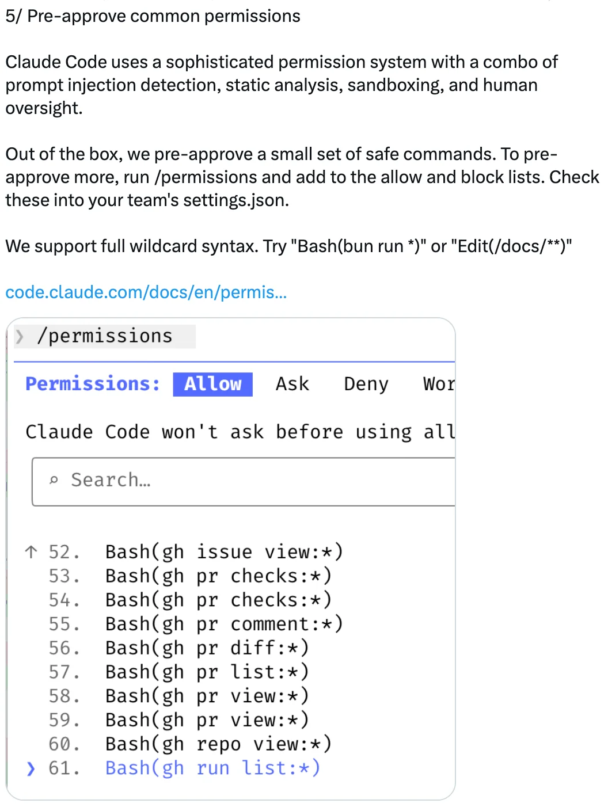
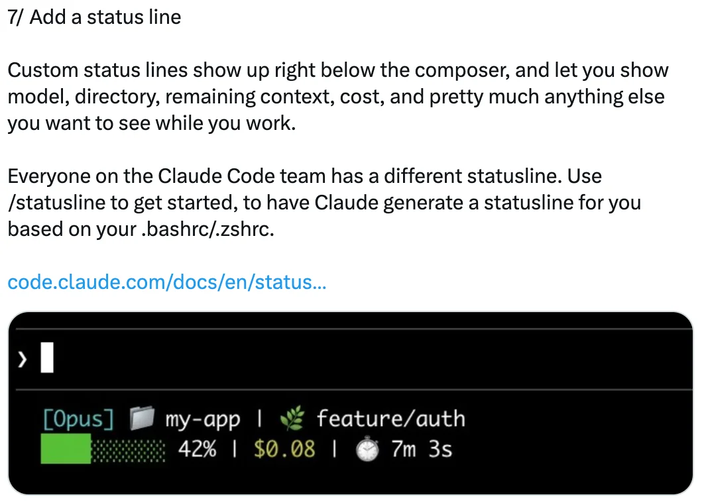
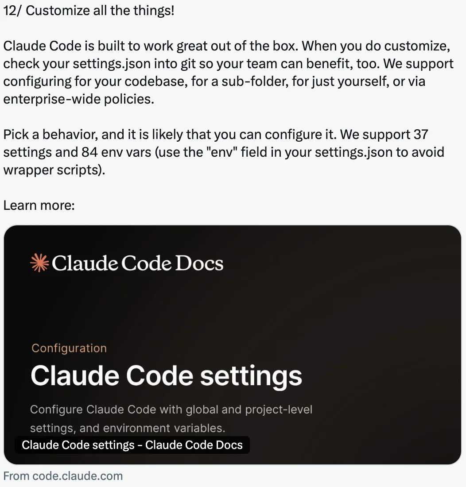

# 12 种自定义 CodeBuddy Code 的方式 — 技巧 from Boris Cherny

CodeBuddy Code 创建者 Boris Cherny ([@bcherny](https://x.com/bcherny)) 于 2026 年 2 月 12 日分享的自定义技巧总结。

<table width="100%">
<tr>
<td><a href="../">← 返回 CodeBuddy Code 最佳实践</a></td>
<td align="right"></td>
</tr>
</table>

---

## 背景

Boris Cherny 指出，可自定义性是工程师们最喜爱 CodeBuddy Code 的特点之一——hooks、插件、LSPs、MCPs、skills、effort、自定义 agents、状态栏、输出样式等等。他分享了开发者和团队正在自定义其配置的 12 种实用方式。

---

## 1/ 配置你的终端

为获得最佳的 CodeBuddy Code 体验，设置你的终端：

- **主题**：运行 `/config` 设置亮色/暗色模式
- **通知**：为 iTerm2 启用通知，或使用自定义通知 hook
- **换行**：如果在 IDE 终端、Apple Terminal、Warp 或 Alacritty 中使用 CodeBuddy Code，运行 `/terminal-setup` 启用 shift+enter 换行（这样你就不需要输入 `\`）
- **Vim 模式**：运行 `/vim`

---

## 2/ 调整 Effort 级别

运行 `/model` 选择你偏好的 effort 级别：

- **Low** — 更少的 token，更快的响应
- **Medium** — 平衡的行为
- **High** — 更多的 token，更高的智能

Boris 的偏好：所有场景都用 High。

---

## 3/ 安装 Plugins、MCPs 和 Skills

Plugins 让你安装 LSPs（适用于所有主流语言）、MCPs、skills、agents 和自定义 hooks。

从官方 Anthropic 插件市场安装，或为你的公司创建自己的市场。将 `settings.json` 检入代码库，自动为你的团队添加市场。

运行 `/plugin` 开始使用。

---

## 4/ 创建自定义 Agents

将 `.md` 文件放入 `.codebuddy/agents` 以创建自定义 agents。每个 agent 可以有自定义名称、颜色、工具集、预先允许和预先禁止的工具、权限模式和模型。

你还可以使用 `settings.json` 中的 `"agent"` 字段或 `--agent` 标志设置主对话的默认 agent。

运行 `/agents` 开始使用。

---

## 5/ 预先批准常用权限

CodeBuddy Code 使用结合了提示注入检测、静态分析、沙箱和人工监督的权限系统。

开箱即用时，一小组安全命令已被预先批准。要预先批准更多命令，运行 `/permissions` 并添加到允许和阻止列表中。将这些检入你团队的 `settings.json`。

支持完整的通配符语法——例如 `Bash(bun run *)` 或 `Edit(/docs/**)`。

---

## 6/ 启用沙箱

选择加入 CodeBuddy Code 的开源沙箱运行时，在减少权限提示的同时提高安全性。

运行 `/sandbox` 启用它。沙箱在你的机器上运行，支持文件和网络隔离。

---

## 7/ 添加状态栏

自定义状态栏显示在编辑区下方，展示模型、目录、剩余上下文、费用以及你在工作时想看到的任何其他信息。

每个团队成员可以有不同的状态栏。使用 `/statusline` 让 CodeBuddy 根据你的 `.bashrc`/`.zshrc` 生成一个。

---

## 8/ 自定义你的键绑定

CodeBuddy Code 中的每个键绑定都是可自定义的。运行 `/keybindings` 重新映射任何按键。设置会实时生效，这样你可以立即感受效果。

---

## 9/ 设置 Hooks

Hooks 让你确定性地介入 CodeBuddy 的生命周期：

- 自动将权限请求路由到 Slack 或 Opus
- 当 CodeBuddy 到达一轮结束时推动它继续（你甚至可以启动一个 agent 或使用提示来决定 CodeBuddy 是否应该继续）
- 对工具调用进行预处理或后处理，例如添加你自己的日志记录

让 CodeBuddy 添加一个 hook 来开始使用。

---

## 10/ 自定义你的加载动画动词

自定义你的加载动画动词，添加或替换默认列表中的动词。将 `settings.json` 检入版本控制，与团队共享动词。

---

## 11/ 使用输出样式

运行 `/config` 设置输出样式，让 CodeBuddy 使用不同的语气或格式进行回复。

- **Explanatory** — 推荐在熟悉新代码库时使用，让 CodeBuddy 在工作时解释框架和代码模式
- **Learning** — 让 CodeBuddy 指导你完成代码更改
- **Custom** — 创建自定义输出样式来调整 CodeBuddy 的风格

---

## 12/ 一切皆可自定义！

CodeBuddy Code 开箱即用效果很好，但当你进行自定义时，将你的 `settings.json` 检入 git，这样你的团队也能受益。配置支持多个层级：

- 为你的代码库
- 为子文件夹
- 仅为你自己
- 通过企业范围的策略

拥有 37 个设置项和 84 个环境变量（使用 `settings.json` 中的 `"env"` 字段以避免包装脚本），你想要的任何行为很可能都是可配置的。

---

## 来源

- [Boris Cherny (@bcherny) on X — 2026 年 2 月 12 日](https://x.com/bcherny)
- [CodeBuddy Code 终端设置文档](https://www.codebuddy.cn/docs/cli/en/terminal)
- [CodeBuddy Code Plugins & Discovery 文档](https://www.codebuddy.cn/docs/cli/en/discover-plugins)
- [CodeBuddy Code Sub-agents 文档](https://www.codebuddy.cn/docs/cli/en/sub-agents)
- [CodeBuddy Code 权限文档](https://www.codebuddy.cn/docs/cli/en/permissions)
- [CodeBuddy Code 沙箱文档](https://www.codebuddy.cn/docs/cli/en/sandbox)
- [CodeBuddy Code 状态栏文档](https://www.codebuddy.cn/docs/cli/en/statusline)
- [CodeBuddy Code 键盘快捷键文档](https://www.codebuddy.cn/docs/cli/en/keybindings)
- [CodeBuddy Code Hooks 参考](https://www.codebuddy.cn/docs/cli/en/hooks)
- [CodeBuddy Code 输出样式文档](https://www.codebuddy.cn/docs/cli/en/output-styles)
- [CodeBuddy Code 设置文档](https://www.codebuddy.cn/docs/cli/en/settings)
