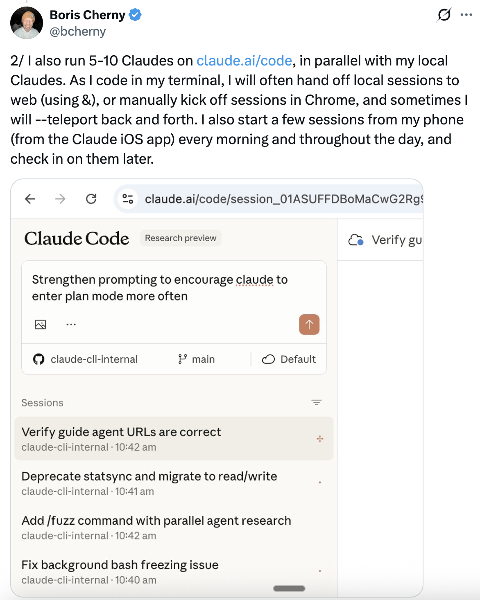
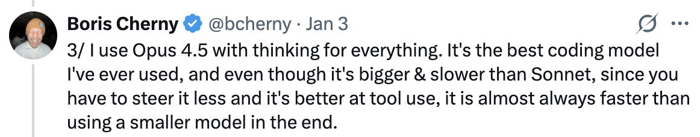
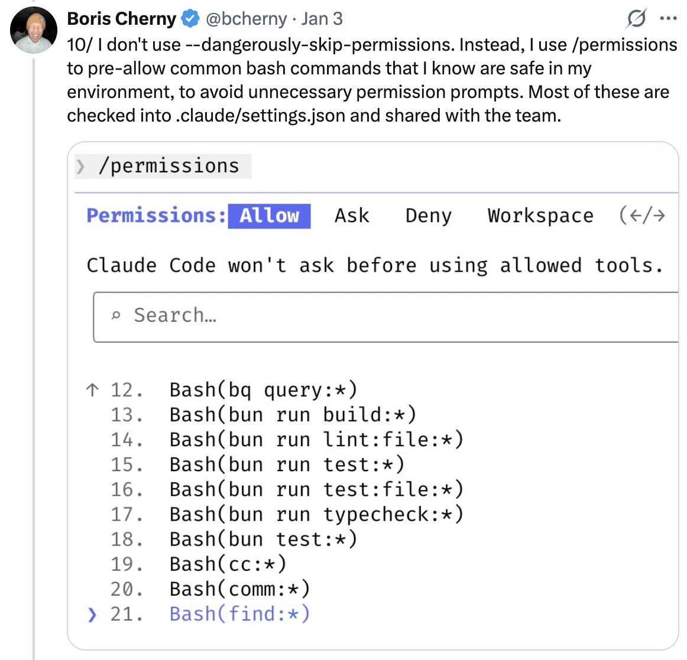
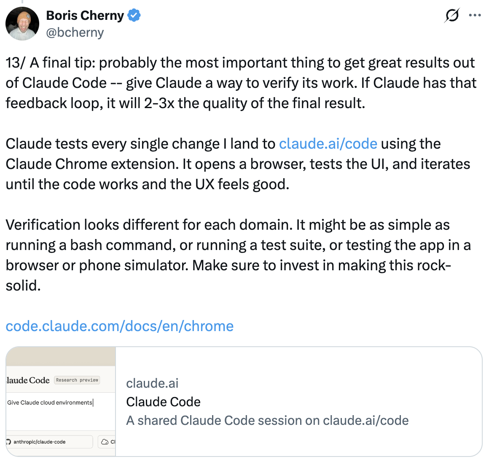

# 我如何使用 CodeBuddy Code — 13 技巧 from Boris Cherny

CodeBuddy Code 创建者 Boris Cherny ([@bcherny](https://x.com/bcherny)) 于 2026 年 1 月 3 日分享的配置技巧总结。

<table width="100%">
<tr>
<td><a href="../">← 返回 CodeBuddy Code 最佳实践</a></td>
<td align="right"></td>
</tr>
</table>

---

## 背景

Boris 分享了他的个人 CodeBuddy Code 配置，并指出它"出奇地朴实"——CodeBuddy Code 开箱即用效果很好，所以他没有做太多自定义。使用它没有唯一正确的方式：团队有意将它设计成你可以随意使用、自定义和修改的样子。CodeBuddy Code 团队中的每个人使用方式都非常不同。

<a href="https://x.com/bcherny/status/2007179832300581177"></a>

---

## 1/ 并行运行 5 个 CodeBuddy

在终端中并行运行 5 个 CodeBuddy。将标签页编号为 1-5，使用系统通知来了解何时 CodeBuddy 需要输入。

参见：[终端设置文档](https://www.codebuddy.cn/docs/cli/en/terminal)

<a href="https://x.com/bcherny/status/2007179833990885678"></a>

---

## 2/ 使用 codebuddy.ai/code 实现更多并行

在 codebuddy.ai/code 上并行运行 5-10 个 CodeBuddy，与本地 CodeBuddy 配合使用。使用 `codebuddy.ai/code` 将本地会话交接到 web 会话，在 Chrome 中手动启动会话，并在两者之间自由切换。

<a href="https://x.com/bcherny/status/2007179836704600237"></a>

---

## 3/ 所有场景都使用带思考的 Opus

所有场景都使用带思考的 Opus 4.5。这是 Boris 使用过的最好的编码模型——虽然它比 Sonnet 更大更慢，但由于你不需要频繁引导它，而且它在工具使用方面更出色，最终几乎总是比使用更小的模型更快。

<a href="https://x.com/bcherny/status/2007179838864666847"></a>

---

## 4/ 与团队共享一个 CODEBUDDY.md

为仓库共享一个 `CODEBUDDY.md`。将其检入 git，让整个团队每周多次贡献。每当 CodeBuddy 做错事情时，将其添加到 `CODEBUDDY.md` 中，这样 CodeBuddy 下次就知道不要这样做。

<a href="https://x.com/bcherny/status/2007179840848597422"></a>

---

## 5/ 在 PR 上 @codebuddy 来更新 CODEBUDDY.md

在代码审查期间，在同事的 PR 上标记 `@codebuddy`，将内容添加到 `CODEBUDDY.md` 中作为 PR 的一部分。使用 CodeBuddy Code GitHub action（[install-@hub-action](https://github.com/apps/codebuddy)）来实现——这是 Boris 版本的复合工程（Compounding Engineering）。

<a href="https://x.com/bcherny/status/2007179842928947333"></a>

---

## 6/ 大多数会话从 Plan 模式开始

大多数会话从 Plan 模式开始（按两次 shift+tab）。如果目标是编写 Pull Request，使用 Plan 模式并与 CodeBuddy 反复交流，直到你满意它的计划。然后切换到自动接受编辑模式，CodeBuddy 通常可以一次性完成。好的计划真的很重要。

<a href="https://x.com/bcherny/status/2007179845336527000"></a>

---

## 7/ 使用 Slash Commands 处理内部循环工作流

对每个你一天做很多次的"内部循环"工作流使用 slash commands。这可以避免重复输入提示，并且让 CodeBuddy 也能使用这些工作流。Commands 检入 git 并存放在 `.codebuddy/commands/` 中。

示例：`/commit-push-pr` — 提交、推送并打开一个 PR。

<a href="https://x.com/bcherny/status/2007179847949500714"></a>

---

## 8/ 使用 Subagents 自动化常见工作流

经常使用几个 subagents：`code-simplifier` 在 CodeBuddy 完成工作后简化代码，`verify-app` 有详细的端到端测试 CodeBuddy Code 的指令，等等。将 subagents 视为自动化最常见的工作流——类似于 slash commands。

Subagents 存放在 `.codebuddy/agents/` 中。

<a href="https://x.com/bcherny/status/2007179850139000872"></a>

---

## 9/ 使用 PostToolUse Hook 自动格式化代码

使用 `PostToolUse` hook 来格式化 CodeBuddy 的代码。CodeBuddy 通常能生成格式良好的代码，hook 处理最后的 10%，以避免之后在 CI 中出现格式错误。

```json
"PostToolUse": [
  {
    "matcher": "Write|Edit",
    "hooks": [
      {
        "type": "command",
        "command": "bun run format || true"
      }
    ]
  }
]
```

<a href="https://x.com/bcherny/status/2007179852047335529"></a>

---

## 10/ 预先允许权限而不是使用 --dangerously-skip-permissions

不要使用 `--dangerously-skip-permissions`。而是使用 `/permissions` 来预先允许你知道在你的环境中安全的常用 bash 命令，以避免不必要的权限提示。其中大部分检入到 `.codebuddy/settings.json` 并与团队共享。

<a href="https://x.com/bcherny/status/2007179854077407667"></a>

---

## 11/ 通过 MCP 让 CodeBuddy 使用你所有的工具

CodeBuddy Code 使用你所有的工具。它经常搜索和发布到 Slack（通过 MCP 服务器），运行 BigQuery 查询来回答分析问题（使用 `bq` CLI），从 Sentry 获取错误日志等。Slack MCP 配置检入到 `.mcp.json` 并与团队共享。

<a href="https://x.com/bcherny/status/2007179856266789204"></a>

---

## 12/ 使用后台 Agents 验证长时间运行的任务

对于非常长时间运行的任务，可以 (a) 提示 CodeBuddy 完成后用后台 agent 验证其工作，(b) 使用 agent Stop hook 更确定性地完成此操作，或 (c) 使用 ralph-wiggum 插件（最初由 @GeoffreyHuntley 构想）。

<a href="https://x.com/bcherny/status/2007179858435281082"></a>

---

## 13/ 给 CodeBuddy 验证其工作的方式

这可能是从 CodeBuddy Code 获得出色结果的最重要的一点——给 CodeBuddy 一种验证其工作的方式。如果 CodeBuddy 有了这个反馈循环，最终结果的质量将提升 2-3 倍。

CodeBuddy 测试了 Boris 提交的每一个更改。

<a href="https://x.com/bcherny/status/2007179861115511237"></a>

---

## 来源

- [Boris Cherny (@bcherny) on X — 2026 年 1 月 3 日](https://x.com/bcherny/status/2007179832300581177)
