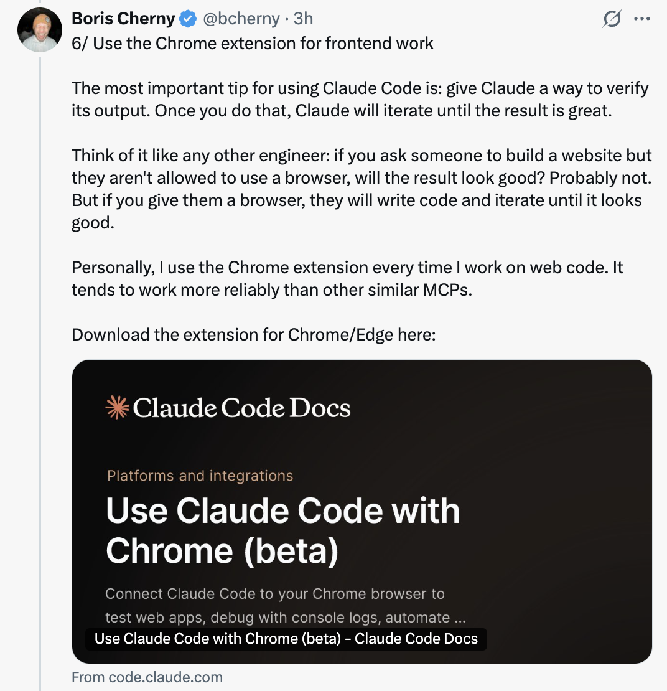
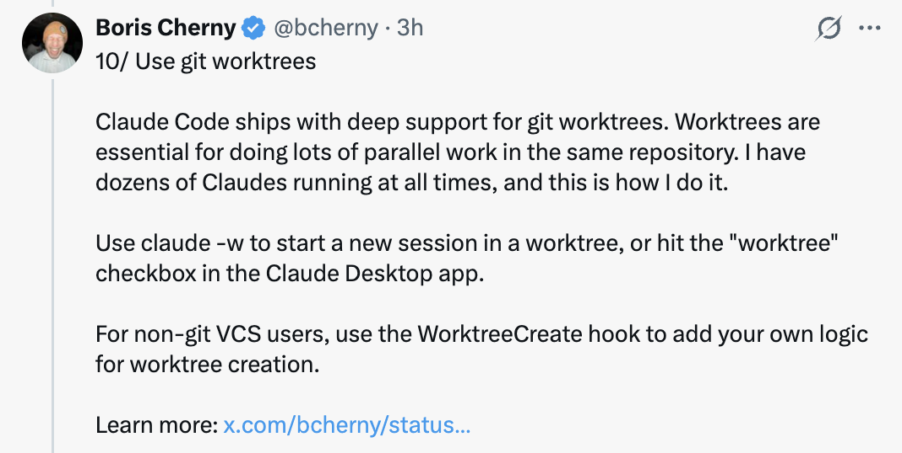
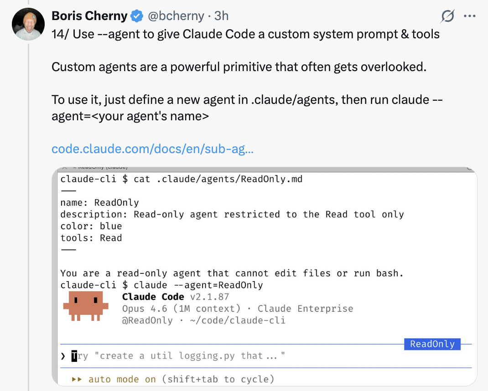

# CodeBuddy Code 的 15 个隐藏且未被充分利用的功能 — 来自 Boris Cherny

Boris Cherny ([@bcherny](https://x.com/bcherny)) 于 2026 年 3 月 30 日分享的技巧总结，他是 CodeBuddy Code 的创建者。

<table width="100%">
<tr>
<td><a href="../">← 返回 CodeBuddy Code 最佳实践</a></td>
<td align="right"></td>
</tr>
</table>

---

## 背景

Boris 分享了他在 CodeBuddy Code 中最喜欢的许多隐藏且未被充分利用的功能，重点介绍了他最常使用的那些。

<a href="https://x.com/bcherny/status/2038454336355999749"></a>

---

## 1/ CodeBuddy Code 有移动应用

你知道 CodeBuddy Code 有移动应用吗？Boris 的很多代码都是在 iOS 应用上编写的 — 这是一种无需打开笔记本电脑即可进行修改的便捷方式。

- 下载 CodeBuddy 应用（iOS/Android）
- 导航到左侧的 **Code** 标签页
- 你可以直接从手机上审查更改、批准 PR 和编写代码

<a href="https://x.com/bcherny/status/2038454337811386436"></a>

---

## 2/ 在移动/网页/桌面和终端之间移动会话

运行 `codebuddy --teleport` 或 `/teleport` 可以将云端会话继续到你的本地机器上。或者运行 `/remote-control` 可以从手机/网页控制本地运行的会话。

- **Teleport（传送）**：将云端会话拉取到你的本地终端
- **Remote Control（远程控制）**：让你从任何设备控制本地会话
- Boris 在他的 `/config` 中设置了 **"Enable Remote Control for all sessions"**

<a href="https://x.com/bcherny/status/2038454339933548804"></a>

---

## 3/ /loop 和 /schedule — 两个最强大的功能

使用这些功能可以安排 CodeBuddy 按设定的间隔自动运行，最长可达一周。Boris 在本地运行着很多循环：

- `/loop 5m /babysit` — 自动处理代码审查、自动变基，并将 PR 推进到生产环境
- `/loop 30m /slack-feedback` — 每 30 分钟自动为 Slack 反馈提交 PR
- `/loop /post-merge-sweeper` — 提交 PR 来处理他遗漏的代码审查评论
- `/loop 1h /pr-pruner` — 关闭过时且不再需要的 PR
- ...还有更多！

尝试将工作流转化为 Skills + 循环。这非常强大。

<a href="https://x.com/bcherny/status/2038454341884154269"></a>

---

## 4/ 使用 Hooks 确定性地运行逻辑

使用 Hooks 在 Agent 生命周期中运行逻辑。例如：

- 每次启动 CodeBuddy 时**动态加载**上下文（`SessionStart`）
- **记录模型运行的每个 bash 命令**（`PreToolUse`）
- 将**权限提示路由**到 WhatsApp 供你批准/拒绝（`PermissionRequest`）
- 每当 CodeBuddy 停止时**推动它继续**（`Stop`）

<a href="https://x.com/bcherny/status/2038454343519932844"></a>

---

## 5/ Cowork Dispatch

Boris 每天都使用 Dispatch 来查看 Slack 和邮件、管理文件，以及在他不在电脑前时处理笔记本上的事情。当他不编码时，他就在使用 Dispatch。

- Dispatch 是 CodeBuddy Desktop 应用的**安全远程控制**
- 它可以在你的许可下使用你的 MCP、浏览器和电脑
- 可以将其视为从任何地方将非编码任务委托给 CodeBuddy 的方式

<a href="https://x.com/bcherny/status/2038454345419936040"></a>

---

## 6/ 使用 Chrome 扩展进行前端开发

使用 CodeBuddy Code 最重要的技巧：**给 CodeBuddy 一种验证其输出的方式。** 一旦你做到了这一点，CodeBuddy 就会不断迭代直到结果很好。

- 可以把它想象成让某人建一个网站但不允许他们使用浏览器 — 结果可能不会好看
- 给 CodeBuddy 一个浏览器，它就会编写代码并迭代直到看起来不错
- Boris 每次开发 Web 代码时都使用 Chrome 扩展 — 它往往比其他类似的 MCP 更可靠

<a href="https://x.com/bcherny/status/2038454347156398333"></a>

---

## 7/ 使用 CodeBuddy Desktop 应用自动启动和测试 Web 服务器

同样，Desktop 应用内置了让 CodeBuddy **自动运行你的 Web 服务器甚至在内置浏览器中测试它的能力。**

- 你可以在 CLI 或 VSCode 中使用 Chrome 扩展设置类似的功能
- 或者直接使用 Desktop 应用获得集成体验

<a href="https://x.com/bcherny/status/2038454348804714642"></a>

---

## 8/ 分叉你的会话

人们经常问如何分叉一个现有的会话。有两种方式：

1. 从你的会话中运行 `/branch`
2. 从 CLI 运行 `codebuddy --resume <session-id> --fork-session`

`/branch` 创建一个分支对话 — 你现在在分支中。要恢复原始会话，使用 `codebuddy -r <original-session-id>`。

<a href="https://x.com/bcherny/status/2038454350214041740"></a>

---

## 9/ 使用 /btw 进行附带查询

Boris 一直在用这个功能在 Agent 工作时回答快速问题。`/btw` 让你在不中断 Agent 当前任务的情况下提出附带问题。

示例：
```
/btw how do I spell dachshund?
> dachshund — German for "badger dog" (dachs + badger, hund + dog).
↑/↓ to scroll · Space, Enter, or Escape to dismiss
```

<a href="https://x.com/bcherny/status/2038454351849787485"></a>

---

## 10/ 使用 Git Worktrees

CodeBuddy Code 深度支持 Git Worktrees。Worktrees 对于在同一个仓库中进行大量并行工作至关重要。Boris **始终运行着几十个 CodeBuddy 实例**，这就是他实现的方式。

- 使用 `codebuddy -w` 在 worktree 中启动新会话
- 或者在 CodeBuddy Desktop 应用中勾选 **"worktree" 复选框**
- 对于非 Git 版本控制用户，使用 `WorktreeCreate` Hook 添加你自己的 worktree 创建逻辑

<a href="https://x.com/bcherny/status/2038454353787519164"></a>

---

## 11/ 使用 /batch 分发大规模变更集

`/batch` 会对你进行提问，然后让 CodeBuddy 将工作分发到尽可能多的 **worktree Agent**（几十个、几百个甚至几千个）来完成任务。

- 用于大型代码迁移和其他可并行化的工作
- 每个 worktree Agent 在自己的代码副本上独立工作

<a href="https://x.com/bcherny/status/2038454355469484142"></a>

---

## 12/ 使用 --bare 将 SDK 启动速度提升高达 10 倍

默认情况下，当你运行 `codebuddy -p`（或 TypeScript 或 Python SDK）时，CodeBuddy 会搜索本地 CODEBUDDY.md 文件、Settings 和 MCP。但对于非交互式使用，大多数时候你想通过 `--system-prompt`、`--mcp-config`、`--settings` 等明确指定要加载的内容。

- 这是 SDK 最初构建时的一个设计疏忽
- 在未来版本中，他们将把默认值切换为 `--bare`
- 目前，使用该标志来获得**高达 10 倍的启动加速**

```bash
codebuddy -p "summarize this codebase" \
    --output-format=stream-json \
    --verbose \
    --bare
```

<a href="https://x.com/bcherny/status/2038454357088457168"></a>

---

## 13/ 使用 --add-dir 让 CodeBuddy 访问更多文件夹

当跨多个仓库工作时，Boris 通常在一个仓库中启动 CodeBuddy 并使用 `--add-dir`（或 `/add-dir`）让 CodeBuddy 看到其他仓库。

- 这不仅告诉 CodeBuddy 关于该仓库的信息，还**赋予它在该仓库中工作的权限**
- 或者，在你的团队 `settings.json` 中添加 `"additionalDirectories"` 以在启动 CodeBuddy Code 时始终加载额外的文件夹

<a href="https://x.com/bcherny/status/2038454359047156203"></a>

---

## 14/ 使用 --agent 为 CodeBuddy Code 提供自定义系统提示词和工具

自定义 Agent 是一个经常被忽视的强大原语。要使用它，只需在 `.codebuddy/agents/` 中定义一个新 Agent，然后运行：

```bash
codebuddy --agent=<your agent's name>
```

- Agent 可以有受限的工具、自定义描述和特定模型
- 它们非常适合创建只读 Agent、专门的审查 Agent 或特定领域的工具

<a href="https://x.com/bcherny/status/2038454360418787764"></a>

---

## 15/ 使用 /voice 启用语音输入

有趣的事实：Boris 的大部分编码工作是通过与 CodeBuddy 对话完成的，而不是打字。

- 在 CLI 中运行 `/voice`，然后按住空格键说话
- 在 Desktop 上按下语音按钮
- 或者在你的 iOS 设置中启用听写功能

<a href="https://x.com/bcherny/status/2038454362226467112"></a>

---

## 来源

- [Boris Cherny (@bcherny) on X — 2026 年 3 月 30 日](https://x.com/bcherny/status/2038454336355999749)
