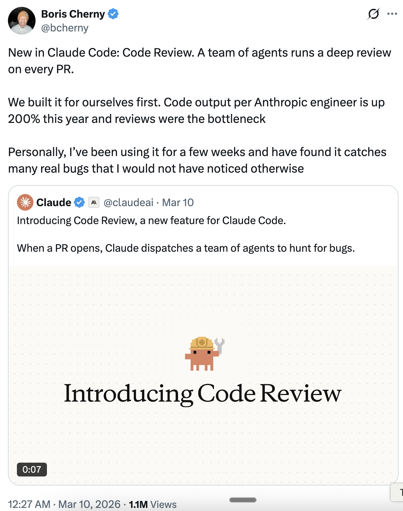

# Code Review & 测试时计算 — 技巧 from Boris Cherny

Boris Cherny ([@bcherny](https://x.com/bcherny))，CodeBuddy Code 的创建者，于 2026 年 3 月 10 日分享的见解摘要。

<table width="100%">
<tr>
<td><a href="../">← 返回 CodeBuddy Code 最佳实践</a></td>
<td align="right"></td>
</tr>
</table>

---

## 1/ 介绍 Code Review

CodeBuddy Code 新功能：**Code Review**。一组 agents 对每个 PR 进行深度审查。

- 首先为 Anthropic 自己的团队打造——每位工程师的代码产出今年提升了 **200%**，而审查是瓶颈
- Boris 已经使用了几周，发现它能捕获许多他本不会注意到的真实 bug
- 当 PR 打开时，CodeBuddy 会派出一组 agents 来搜寻 bug

---

## 2/ 测试时计算 & 多上下文窗口

大致来说，你投入编码问题的 token 越多，结果就越好。Boris 将此称为**测试时计算**。

- 使用**独立的上下文窗口**可以让结果更好——这正是 Subagents 工作的原理，也是一个 agent 可能产生 bug 而另一个（使用完全相同的模型）可以发现 bug 的原因
- 类似于工程团队：如果 Boris 产生了一个 bug，他的同事审查代码时可能比他自己更能可靠地发现它
- 从极限来看，agents 最终可能会写出完美的无 bug 代码——在那之前，**多个不相关的上下文窗口**往往是一个好的方法

---

## 来源

- [Boris Cherny (@bcherny) on X — 2026 年 3 月 10 日](https://x.com/bcherny)
