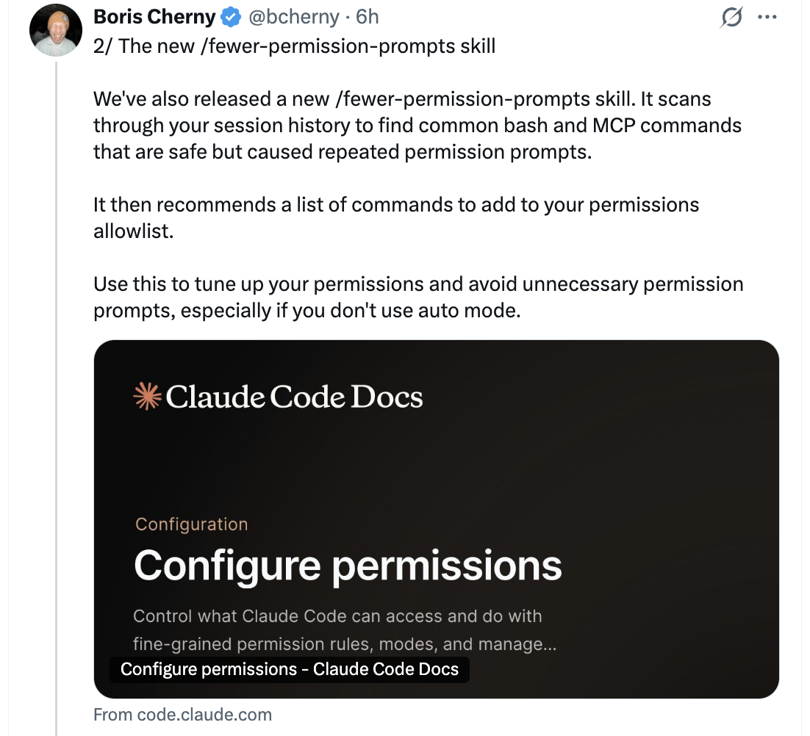
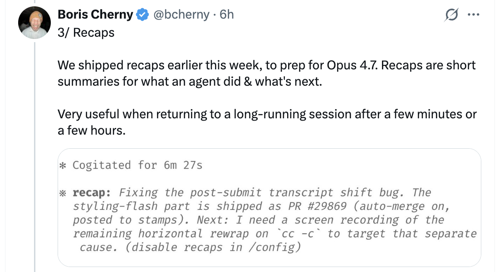
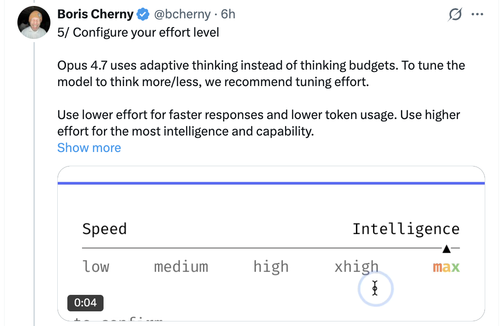

# 充分利用 Opus 4.7 的 6 个技巧 — 来自 Boris Cherny

Boris Cherny ([@bcherny](https://x.com/bcherny)) 于 2026 年 4 月 16 日分享的技巧推文串 — 在过去几周亲自试用 Opus 4.7 之后。

<table width="100%">
<tr>
<td><a href="../">← 返回 CodeBuddy Code 最佳实践</a></td>
<td align="right"></td>
</tr>
</table>

---

## 背景

在亲自试用 Opus 4.7 几周后，Boris 感到"效率惊人"，并分享了六种充分利用新模型的方式 — 从权限自动化到努力程度调节再到验证模式。

<a href="https://x.com/bcherny"></a>

---

## 1/ Auto 模式 — 告别权限提示

Opus 4.7 喜欢执行复杂、长时间运行的任务：深度研究、重构代码、构建复杂功能、迭代直到达到性能基准。过去，你需要在模型执行这类长时间任务时在一旁盯着，或者使用 `--dangerously-skip-permissions`。

Anthropic 最近推出了 **Auto 模式**作为更安全的替代方案。在此模式下，权限提示会被路由到一个基于模型的分类器，由它决定命令是否可以安全运行：

- 如果安全，自动批准
- 如果有风险，暂停并询问

这意味着在模型运行时不再需要在一旁盯着。更重要的是，你可以并行运行更多 CodeBuddy 实例 — 如果安全，你可以将注意力切换到下一个 CodeBuddy。

Auto 模式现在对 Max、Teams 和 Enterprise 用户的 Opus 4.7 开放。在 CLI 中按 **Shift+Tab** 可在 `Ask permissions` → `Plan mode` → `Auto mode` 之间切换，或在 Desktop 或 VS Code 的下拉菜单中选择。

<a href="https://x.com/bcherny"></a>

---

## 2/ 新的 /fewer-permission-prompts Skill

Anthropic 发布了一个新的 `/fewer-permission-prompts` Skill。它会扫描你的会话历史，找到那些安全但反复提示权限的 bash 和 MCP 命令。然后它会推荐一组命令，添加到你的权限允许列表中。

使用它来调整你的权限设置，避免不必要的权限提示，特别是如果你不使用 Auto 模式的话。

<a href="https://x.com/bcherny"></a>

---

## 3/ Recaps（回顾摘要）

Anthropic 在本周早些时候发布了 **Recaps** 功能，为 Opus 4.7 做准备。Recaps 是对 Agent 做了什么以及接下来要做什么的简短摘要。

当你在几分钟或几小时后回到一个长时间运行的会话时非常有用：

```
* Cogitated for 6m 27s

* 概要：修复提交后转录移位问题。样式闪现部分已通过PR #29869提交（自动合并已开启，已发布至stamps）。下一步：我需要一个关于`cc -c`水平重排问题的屏幕录制，以定位其他原因。（在/config中禁用概要功能）

如果你不想要 Recaps，可以在 `/config` 中禁用。

<a href="https://x.com/bcherny"></a>

---

## 4/ Focus 模式（专注模式）

Boris 非常喜欢 CLI 中新的 **Focus 模式**，它隐藏了所有中间工作，只关注最终结果。模型已经达到了一个他通常信任它会运行正确命令和做出正确编辑的程度。他只看最终结果。

使用 `/focus` 来开启/关闭。

<a href="https://x.com/bcherny"></a>

---

## 5/ 配置你的努力程度

Opus 4.7 使用**自适应思考**代替思考预算。要调节模型思考的多少，请调整努力程度。

- **较低努力** — 更快的响应和更低的 token 使用量
- **较高努力** — 最高的智能和能力

滑块呈现五个级别：`low` · `medium` · `high` · `xhigh` · `max` — 左侧为速度，右侧为智能。

<a href="https://x.com/bcherny"></a>

---

## 6/ 给 CodeBuddy 一种验证其工作的方式

最后，确保 CodeBuddy 有办法验证它的工作。这一直很重要 — 现在 4.7 让 CodeBuddy 的产出提升了 2-3 倍，所以这比以往任何时候都更重要。

验证方式因任务而异：

- **后端工作** — 让 CodeBuddy 运行你的服务器/服务进行端到端测试
- **前端工作** — 使用 [CodeBuddy Chromium 扩展](https://www.codebuddy.cn/docs/cli/en/chrome) 让 CodeBuddy 能够控制你的浏览器
- **桌面应用** — 使用 Computer Use

Boris 现在的提示看起来像 `CodeBuddy do blah blah /go`，其中 `/go` 是一个 Skill，它会：

1. 使用 bash、浏览器或 Computer Use 进行端到端测试
2. 运行 `/simplify`
3. 提交 PR

对于长时间运行的工作，验证更加重要 — 当你回到一个任务时，你知道代码是可以工作的。

<a href="https://x.com/bcherny"></a>

---

## 来源

- [Boris Cherny (@bcherny) on X — 2026 年 4 月 16 日](https://x.com/bcherny)
