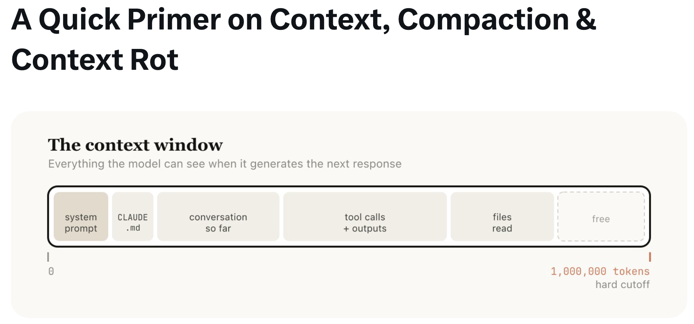
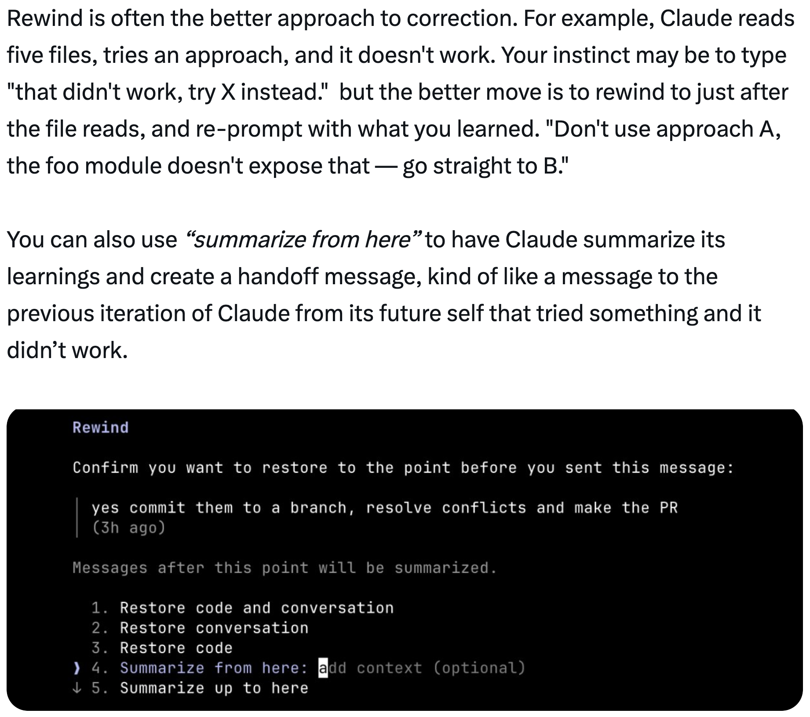
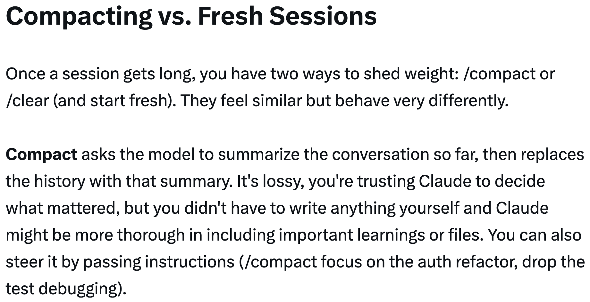
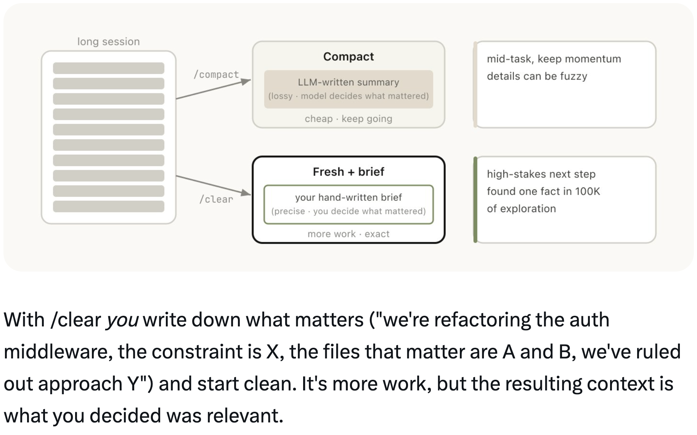
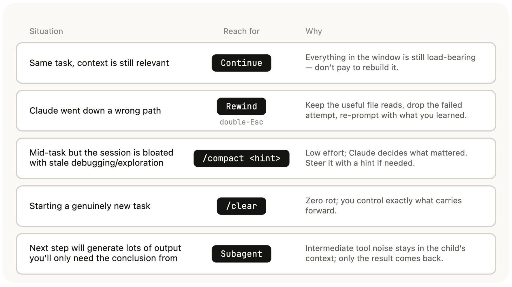

# 使用 CodeBuddy Code：会话管理与 1M 上下文 — Thariq

一份关于 CodeBuddy Code 中会话管理、上下文窗口和压缩的指南，由 Thariq ([@trq212](https://x.com/trq212)) 于 2026 年 4 月 16 日分享。

<table width="100%">
<tr>
<td><a href="../">← 返回 CodeBuddy Code 最佳实践</a></td>
<td align="right"></td>
</tr>
</table>

---

## 背景

借助 1M token 的上下文窗口，CodeBuddy Code 可以更可靠地处理更长的任务 — 但如果你不刻意管理会话，它也为上下文污染打开了大门。会话管理比以往任何时候都更重要：何时重新开始、何时压缩、何时回退，以及何时委托给 Subagents。

---

## 上下文、压缩与上下文腐化的快速入门

上下文窗口是模型在生成下一个回复时能够一次性"看到"的所有内容。它包括你的系统提示词、到目前为止的对话、每个工具调用及其输出，以及每个被读取的文件。CodeBuddy Code 的上下文窗口为**一百万 token**。

不幸的是，使用上下文有轻微的代价 — **上下文腐化（context rot）**。随着上下文增长，模型性能会下降，因为注意力被分散到更多 token 上，而旧的、不相关的内容开始分散当前任务的注意力。对于 1M 上下文模型，某种程度的上下文腐化会在大约 **~300-400k token** 时发生，但这很大程度上取决于任务 — 不是硬性规则。

上下文窗口有硬性限制。当你接近末尾时，需要总结任务并在新的上下文窗口中继续 — 这就是**压缩（compaction）**。你也可以自己触发压缩。

---

## 每一轮都是一个分支点

当 CodeBuddy 完成一轮对话后，你有数量惊人的选择可以做接下来的事：

- **继续** — 在同一会话中发送另一条消息
- **/rewind (esc esc)** — 跳回到之前的消息并从那里重新开始
- **/clear** — 开始一个新会话，通常带着你从刚才学到的内容中提炼出的简报
- **Compact（压缩）** — 总结到目前为止的会话，并在摘要基础上继续
- **Subagents（子代理）** — 将下一块工作委托给一个拥有自己干净上下文的 Agent，然后只将其结果拉回来

虽然最自然的做法是继续，但其他四个选项的存在是为了帮助你管理上下文。

每个选项携带不同数量的已有上下文：

| 新建会话 | 压缩 | Subagent | 回退 | 继续 |
|:---:|:---:|:---:|:---:|:---:|
| 仅你的简报 | 有损摘要 | 全部 + 结果 | 前缀保留，尾部截断 | 一切保留 |
| *无* | | | | *全部* |

---

## 何时开始新会话

新的 1M 上下文窗口意味着你现在可以更可靠地完成更长的任务 — 例如从零开始构建一个全栈应用。但仅仅因为模型还没用完上下文，并不意味着你不应该开始新会话。

**通用经验法则：当你开始一个新任务时，也应该开始一个新会话。**

灰色地带是你可能想做相关任务，其中部分上下文仍然需要，但不是全部。例如，为你刚刚实现的功能编写文档。虽然你可以开始一个新会话，但 CodeBuddy 就必须重新读取文件，这会更慢且更昂贵。由于文档可能不是高度智能敏感的任务，额外的上下文可能值得以换取效率提升。

---

## 回退而非纠正

如果 Thariq 要选一个代表良好上下文管理的习惯，那就是**回退（rewind）**。

在 CodeBuddy Code 中，双击 Esc（或运行 `/rewind`）可以让你跳回到任何之前的消息并从那里重新提示。该时间点之后的消息会从上下文中被丢弃。

**纠正**（在失败的尝试 A 后说"不行，试试 B"）会在上下文中留下失败的尝试：
> 上下文 = 读取内容 + 2 次失败尝试 + 2 次纠正 + 修复方案

**回退**（回到失败尝试之前，用你学到的东西重新提示）更干净：
> 上下文 = 读取内容 + 一条有依据的提示 + 修复方案

回退通常是更好的方式。例如，CodeBuddy 读取了五个文件，尝试了一种方法，但不奏效。你的本能可能是输入"那不行，试试 X。"但更好的做法是回退到文件读取之后，用你学到的东西重新提示："不要用方法 A，foo 模块没有暴露那个接口 — 直接用 B。"

你也可以使用**"summarize from here"**让 CodeBuddy 总结它的发现并创建一个交接消息，就像是一条从尝试过但失败的 CodeBuddy 发送给之前的 CodeBuddy 的消息。

---

## 压缩 vs. 新建会话

当会话变长时，你有两种方式减轻负担：`/compact` 或 `/clear`（重新开始）。它们感觉相似但行为非常不同。

**压缩**要求模型总结到目前为止的对话，然后用该摘要替换历史记录。这是有损的 — 你在信任 CodeBuddy 来决定什么重要，但你不必自己写任何东西。CodeBuddy 在包含重要发现或文件方面可能更彻底。你也可以通过传递指令来引导它（`/compact focus on the auth refactor, drop the test debugging`）。

- **任务中途**，保持动量 — 细节可以模糊
- 代价低，继续前进

**新建 + 简报**（`/clear`）意味着*你*写下重要的内容（"我们正在重构 auth 中间件，约束是 X，重要的文件是 A 和 B，我们已经排除了方法 Y"），然后干净地开始。工作量更大，但结果上下文是*你*决定相关的。

- **高风险**的下一步 — 在 100K 的探索中只找到一个事实
- 工作量更大，更精确

---

## 什么导致了糟糕的压缩？

如果你运行了很多长时间的会话，你可能已经注意到压缩有时会特别糟糕。当模型无法预测你工作的方向时，糟糕的压缩就会发生。

例如，自动压缩在一个长时间的调试会话后触发并总结了调查过程。你的下一条消息是"现在修复我们在 bar.ts 中看到的另一个警告。"但由于会话集中在调试上，另一个警告可能已从摘要中被丢弃。

这尤其困难，因为由于上下文腐化，模型在压缩时处于最不智能的状态。有了 100 万上下文，你有更多时间主动 `/compact` 并描述你接下来想做什么。

---

## Subagents 与全新的上下文窗口

Subagents 是一种上下文管理形式，当你事先知道一块工作会产生大量你不会再需要的中间输出时非常有用。

当 CodeBuddy 通过 Agent 工具生成一个 Subagent 时，该 Subagent 会获得自己全新的上下文窗口。它可以做尽可能多的工作，然后综合其结果，只有最终报告会返回给父级。

心理测试：**我会再次需要这个工具输出吗，还是只需要结论？**

探索过程中的噪音在 Subagent 退出时被垃圾回收 — 20 次文件读取、12 次 grep、3 次死胡同 — 只有最终报告返回到父上下文。

虽然 CodeBuddy Code 会自动调用 Subagents，但你可能想让它明确这样做。例如：

- "启动一个 Subagent 来根据以下规范文件验证这项工作的结果"
- "启动一个 Subagent 来阅读这个其他代码库并总结它如何实现 auth 流程，然后按照同样的方式自己实现"
- "启动一个 Subagent 来根据我的 git 变更编写这个功能的文档"

---

## 总结

当 CodeBuddy 结束一轮对话而你正要发送新消息时，你有一个决策点。随着时间推移，CodeBuddy 将自己处理这些，但目前这是你可以引导 CodeBuddy 输出的方式之一。

| 场景 | 使用 | 原因 |
|-----------|-----------|-----|
| 同一任务，上下文仍然相关 | **继续** | 窗口中的所有内容仍然有用 — 不���花钱重建它 |
| CodeBuddy 走上了错误的道路 | **回退**（双击 Esc） | 保留有用的文件读取，丢弃失败的尝试，用你学到的重新提示 |
| 任务中途但会话被过时的调试/探索膨胀 | **/compact \<提示\>** | 成本低；CodeBuddy 决定什么重要。如果需要可以用提示引导 |
| 开始一个真正的新任务 | **/clear** | 零腐化；你完全控制什么被传递 |
| 下一步将产生大量你只需要结论的输出 | **Subagent** | 中间的工具噪音留在子上下文中；只有结果回来 |

---

## 来源

- [Thariq (@trq212) on X — 2026 年 4 月 16 日](https://x.com/trq212)
