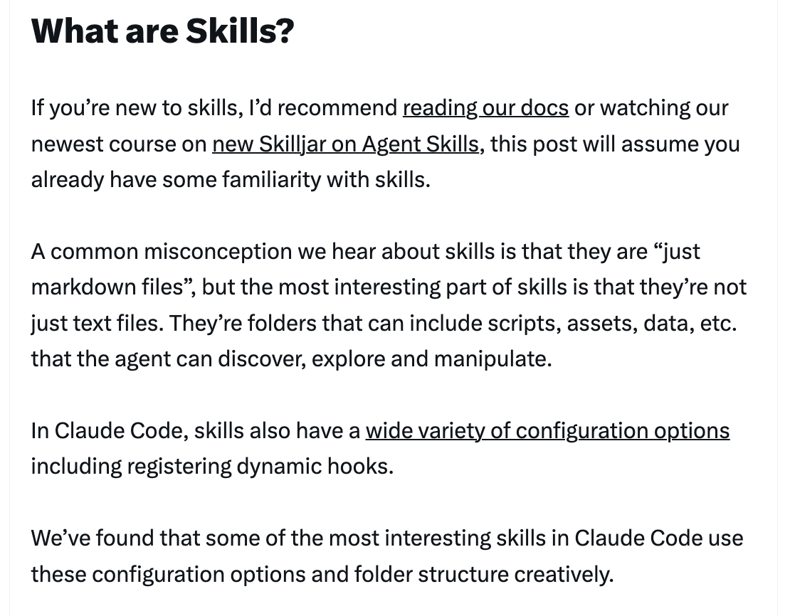
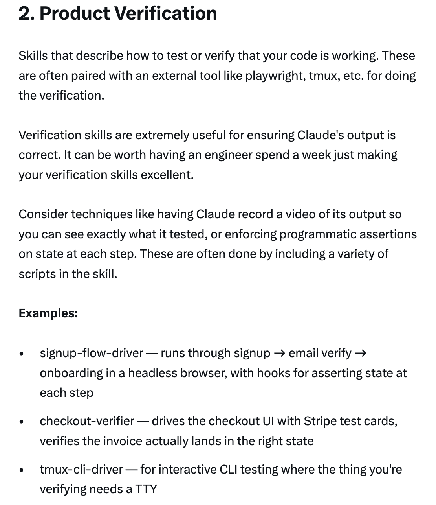
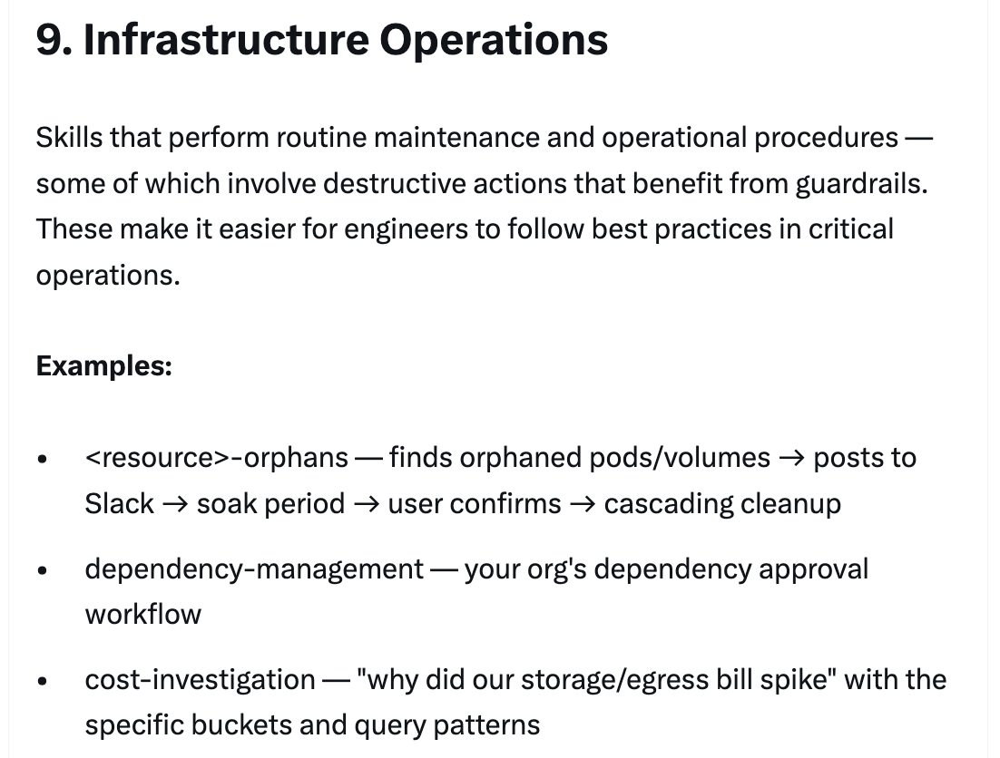

# 构建 CodeBuddy Code 的经验教训：我们如何使用 Skills — Thariq

关于 Anthropic 内部如何使用 skills 的全面指南，由 Thariq ([@trq212](https://x.com/trq212)) 于 2026 年 3 月 17 日分享。

<table width="100%">
<tr>
<td><a href="../">← 返回 CodeBuddy Code 最佳实践</a></td>
<td align="right"></td>
</tr>
</table>

---

## 背景

Skills 已成为 CodeBuddy Code 中使用最广泛的扩展点之一。它们灵活、易于创建且便于分发。但这种灵活性也使人难以确定最佳实践。Thariq 分享了在团队内部大量使用 skills 的经验教训——他们有数百个 skills 正在活跃使用中。

---

## 什么是 Skills？

一个常见的误解是 skills "只是 Markdown 文件"，但实际上最有趣的部分是它们是**文件夹**，可以包含脚本、资源、数据等——这些是 agent 可以发现、探索和操作的内容。Skills 还有各种各样的配置选项，包括注册动态 Hooks。

---

## Skills 的类型

在对所有 skills 进行分类后，团队发现它们可以归入 9 个常见类别。最好的 skills 清晰地归入某一类；令人困惑的则横跨多个类别。

---

### 1/ 库与 API 参考

解释如何正确使用库、CLI 或 SDK 的 Skills。这些可以是内部库或 CodeBuddy Code 有时难以处理的常用库。它们通常包含一个参考代码片段文件夹和编写脚本时需要避免的常见问题列表。

**示例：** billing-lib, internal-platform-cli, frontend-design

---

### 2/ 产品验证

描述如何测试或验证代码是否正常工作的 Skills。这些通常与 Playwright、tmux 等外部工具配合使用。验证 Skills 对于确保 CodeBuddy 的输出正确非常有用。值得让一位工程师花一周时间专门优化验证 Skills。

**示例：** signup-flow-driver, checkout-verifier, tmux-cli-driver

---

### 3/ 数据获取与分析

连接到数据和监控系统的 Skills。这些可能包括带凭据获取数据的库、特定的仪表板 ID 等，以及常见工作流或获取数据方式的说明。

**示例：** funnel-query, cohort-compare, grafana

---

### 4/ 业务流程与团队自动化

将重复性工作流自动化为一条命令的 Skills。这些通常是比较简单的指令，但可能对其他 Skills 或 MCP 有更复杂的依赖关系。将之前的结果保存在日志文件中可以帮助模型保持一致性并参考之前的工作流执行结果。

**示例：** standup-post, create-\<ticket-system\>-ticket, weekly-recap

---

### 5/ 代码脚手架与模板

为代码库中特定功能生成框架样板代码的 Skills。你可以将这些 Skills 与可组合的脚本结合使用。当你的脚手架有无法纯靠代码覆盖的自然语言需求时，它们特别有用。

**示例：** new-\<framework\>-workflow, new-migration, create-app

---

### 6/ 代码质量与审查

在组织内部强制执行代码质量并帮助审查代码的 Skills。这些可以包含确定性的脚本或工具以实现最大鲁棒性。你可能希望将这些 Skills 作为 Hooks 的一部分或在 GitHub Action 中自动运行。

**示例：** adversarial-review, code-style, testing-practices

---

### 7/ CI/CD 与部署

帮助你在代码库中获取、推送和部署代码的 Skills。这些 Skills 可能会引用其他 Skills 来收集数据。

**示例：** babysit-pr, deploy-\<service\>, cherry-pick-prod

---

### 8/ 运维手册

接受一个症状（如 Slack 线程、告警或错误签名），通过多工具调查进行排查，并生成结构化报告的 Skills。

**示例：** \<service\>-debugging, oncall-runner, log-correlator

---

### 9/ 基础设施运维

执行例行维护和运维操作的 Skills——其中一些涉及需要防护栏的破坏性操作。这些 Skills 使工程师在关键操作中更容易遵循最佳实践。

**示例：** \<resource\>-orphans, dependency-management, cost-investigation

---

## 创建 Skills 的技巧

编写高效 Skills 的 9 个最佳实践，以及分发和度量的指导。

---

### 提示 1：不要陈述显而易见的内容

CodeBuddy Code 对你的代码库了解很多，CodeBuddy 也知道很多关于编码的知识，包括许多默认观点。如果你发布的 Skill 主要是关于知识的，试着聚焦于那些能让 CodeBuddy 脱离其常规思维方式的信息。前端设计 Skill ��一个很好的例子——它是通过与客户迭代改进 CodeBuddy 的设计品味而构建的，避免了 Inter 字体和紫色渐变等经典模式。

---

### 提示 2：构建常见问题 (Gotchas) 部分

任何 Skill 中信噪比最高的内容就是 Gotchas 部分。这些部分应该基于 CodeBuddy 在使用你的 Skill 时遇到的常见失败点来构建。理想情况下，你会随着时间的推移更新 Skill 来捕获这些注意事项。

---

### 提示 3：使用文件系统与渐进式披露

Skill 是一个文件夹，而不仅仅是一个 Markdown 文件。你应该把整个文件系统看作一种上下文工程和渐进式披露的形式。告诉 CodeBuddy 你的 Skill 中有哪些文件，它会在适当的时候读取它们。最简单的形式是指向其他 Markdown 文件——例如，将详细的函数签名和使用示例拆分到 `references/api.md` 中。你可以有 references、scripts、examples 等文件夹。

---

### 提示 4：避免过度约束 CodeBuddy

CodeBuddy 通常会尽量遵循你的指令，而且由于 Skills 的复用性很高，你需要小心不要过于具体。给 CodeBuddy 它需要的信息，但要让它有灵活性来适应情况。与其给出规定性的逐步指令，不如给出目标和约束条件。

---

### 提示 5：仔细考虑设置流程

某些 Skills 可能需要从用户那里获取上下文信息来设置。一个好的模式是将这些设置信息存储在 Skill 目录下的 `config.json` 文件中。如果配置未设置，agent 可以向用户请求信息。你可以指示 CodeBuddy 使用 AskUserQuestion 工具来提出结构化的多选问题。

---

### 提示 6：描述字段是给模型看的

当 CodeBuddy Code 启动会话时，它会构建每个可用 Skill 及其描述的列表。这个列表就是 CodeBuddy 扫描以判断"这个请求有对应的 Skill 吗？"的依据。这意味着描述字段不是一个摘要——它是关于**何时触发**这个 Skill 的描述。为模型而写。

---

### 提示 7：记忆与数据存储

一些 Skills 可以通过在其内部存储数据来包含某种形式的记忆。你可以将数据存储在简单的仅追加文本日志文件或 JSON 文件中，也可以存储在复杂的 SQLite 数据库中。存储在 Skill 目录中的数据在升级 Skill 时可能会被删除，所以请使用 `${CODEBUDDY_PLUGIN_DATA}` 作为每个插件的稳定存储文件夹。

---

### 提示 8：存储脚本与生成代码

你可以给 CodeBuddy 的最强大工具之一就是代码。给 CodeBuddy 脚本和库可以让 CodeBuddy 把它的回合花在组合上，决定下一步做什么，而不是重构样板代码。CodeBuddy 随后可以动态生成脚本来组合这些功能以进行更高级的分析。

---

### 提示 9：按需 Hooks

Skills 可以包含仅在 Skill 被调用时才激活的 Hooks，其持续时间为会话期间。将此用于你不想一直运行但有时非常有用的更有主见的 Hooks。

**示例：**
- `/careful` — 通过 PreToolUse Bash 匹配器阻止 rm -rf、DROP TABLE、force-push、kubectl delete
- `/freeze` — 阻止不在特定目录中的任何 Edit/Write 操作

---

## 分发 Skills

与团队共享 Skills 的两种方式：
- **提交到仓库**（放在 `.codebuddy/skills` 下）——最适合在相对较少的仓库中工作的小型团队
- **制作插件**并建立 CodeBuddy Code 插件市场，用户可以在其中上传和安装插件

每一个提交的 Skill 也会为模型的上下文增加一点内容。随着规模扩大，内部插件市场允许你分发 Skills 并让你的团队决定安装哪些。

---

## 管理市场

没有一个集中的团队来决定哪些 Skills 进入市场。相反，试着有机地发现最有用的 Skills。上传到 GitHub 中的沙盒文件夹，并在 Slack 或其他论坛中引导人们去查看。一旦一个 Skill 获得了关注（由 Skill 所有者决定），他们可以提交 PR 将其移入市场。发布前的策划很重要，以避免冗余的 Skills。

---

## 组合 Skills

你可能希望有相互依赖的 Skills。例如，一个上传文件的文件上传 Skill 和一个生成 CSV 并上传的 CSV 生成 Skill。这种依赖管理目前还没有内建到市场或 Skills 中，但你可以通过名称引用其他 Skills，如果它们已安装，模型就会调用它们。

---

## 度量 Skills

要了解一个 Skill 的表现如何，可以使用 PreToolUse Hook 来记录公司内的 Skill 使用情况。这意味着你可以找到热门的或与预期相比触发不足的 Skills。

---

## 总结

Skills 对 agents 来说是极其强大和灵活的工具，但目前仍处于早期阶段，我们都在探索如何最好地使用它们。与其说这是一份权威指南，不如说这是我们看到有效的一组实用技巧的合集。理解 Skills 的最佳方式是动手开始、尝试实验，看看什么对你有效。我们的大多数 Skills 起初只有几行代码和一个注意事项，然后因为人们在 CodeBuddy 遇到新的边缘情况时不断添加内容而变得更好。

---

## 来源

- [Thariq (@trq212) on X — 2026 年 3 月 17 日](https://x.com/trq212/status/2033949937936085378)
- [Skilljar — Agent 技能课程](https://www.codebuddy.cn/docs/cli/en/skills)
- [技能创建器](https://www.codebuddy.cn/docs/cli/en/skills)